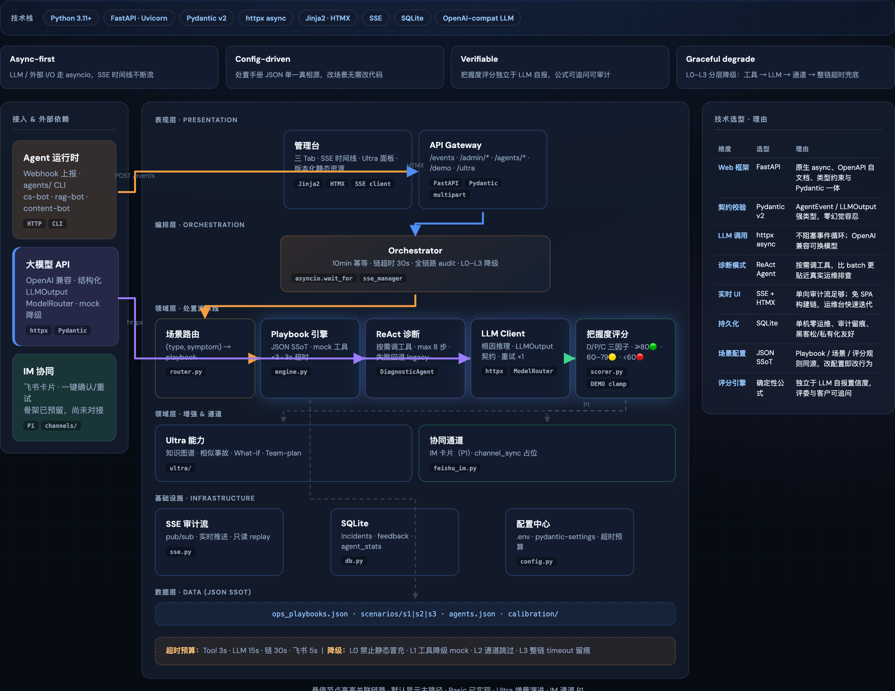
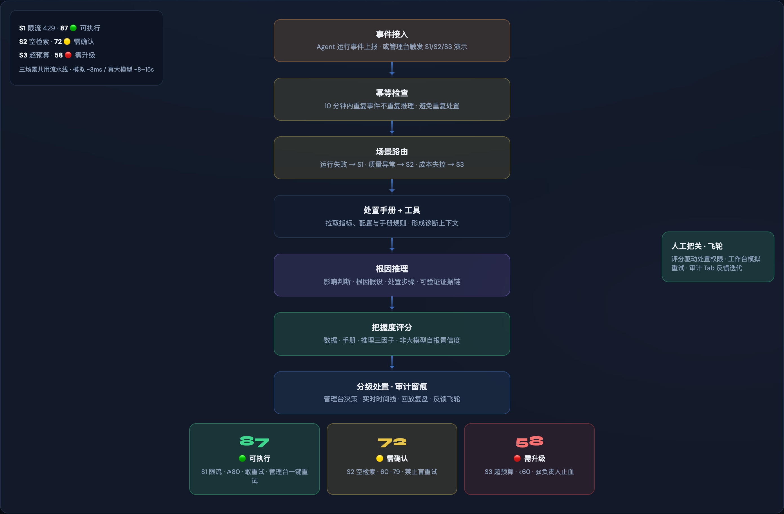

<div align="center">

# CoAgent

### AI Agent 事故指挥官

Agent 一上线，真正的考验才开始：任务跑挂了、质量不堪入目、项目成本失控，各种事故说来就来。

CoAgent 是一款 Agent Ops 工具，让你在事故出现的第一时间看到问题、敢于拍板——通过多层工具诊断 + 结构化契约，把根因梳理出来；按事故等级自动进入处置流程；实时通知、审计留痕，处置手册还能异步迭代。

从发现到复盘，**CoAgent 让 Agent 事故处置有闭环、能解释、可验证**。


🌐 [官网](http://www.aikipedia.cn/coagent/) · 📊 [路演 PPT](https://tiny-crumble-616b23.netlify.app/) · 🏗 [架构图](docs/diagrams/coagent-architecture.html) · 📐 [C4 · Inline Observer](docs/architecture/c4-inline-observer.html) · 📚 [文档索引](docs/README.md) · 📘 [开发文档](docs/dev-deploy-test.md)

<br />

[](docs/demos/coagent-demo-mp4.mp4)

*事件接入 → 场景路由 → 处置手册+工具 → 根因推理 → 把握度评分 → 分级处置 · 审计留痕*

</div>

---

## 为什么需要 CoAgent

**Agent 做 demo 都挺好，一上线就翻车——而出事那一刻，没人敢拍板。**

企业 Agent 试验已很普遍，但真正跑在生产里的系统，往往卡在「出事时怎么办」：排查慢、靠老师傅、不留痕、不敢动。CoAgent 聚焦 **Agent 上线之后的运行态运维**，把**处置决策**做成产品，而不是又一套告警面板。

| 典型事故 | 你现在的困境 | CoAgent 帮你 |
|---|---|---|
| 客服 Agent 被限流，失败率飙升 | 跨系统查日志，只能等原工程师 | 给出根因假设、影响判断和可执行建议 |
| RAG Agent 空检索仍胡答 | 指标看起来正常，盲目重试更糟 | 识别质量异常，明确「不能盲动」 |
| 内容 Agent Token 超预算 | 只知道超支，不知限流还是暂停 | 风险分级，高风险动作必须升级 |

**适合谁用：** Agent 交付团队、企业 AI 平台与 SRE、接手第三方 Agent 的客户 IT——也就是**出岔子时得拍板「动还是不动」的那个人**。

---

## 应用场景

CoAgent 面向 **Agent 进入生产后的运行态运维**，覆盖三类最常见的事故切面：

| 场景 | 典型 Agent | 何时触发 | 值班诉求 |
|---|---|---|---|
| **运行失败** | 客服 / 工单 Agent | 大促并发上升、API 限流、调用失败 | 快速判断根因，敢不敢重试 |
| **质量异常** | RAG / 知识库 Agent | 索引延迟、空检索、幻觉答复 | 基础设施指标正常时仍能发现「答错了」 |
| **成本失控** | 内容 / 营销 Agent | 模板变更、流量激增、日预算超标 | 止损与升级，避免误操作扩大影响 |

**角色与用法：**

| 角色 | 典型用法 |
|---|---|
| **Agent 交付 / FDE** | 接入运行事件，按业务配置处置手册与评分规则 |
| **平台 SRE / 值班** | 在管理台完成诊断、分级处置与一键模拟重试 |
| **客户 IT / 运维负责人** | 接手第三方 Agent，依据评分与审计链安全拍板 |

**内置演示（S1 / S2 / S3）** 用同一套流水线展示 **敢动手 → 不敢盲动 → 必须升级** 的处置边界递进：

| 演示 | 映射场景 | 典型因果 | 决策 |
|---|---|---|---|
| **S1** 客服限流 | 运行失败 | 并发↑ → 429 → 服务不可用 | 🟢 可重试 |
| **S2** RAG 空检索 | 质量异常 | 索引 lag → 空检索 → 错误回答 | 🟡 需确认 |
| **S3** 成本超预算 | 成本失控 | 流量/模板↑ → Token↑ → 超日预算 | 🔴 升级负责人 |

---

## CoAgent 做什么

一条流水线，覆盖从发现到复盘：

| 阶段 | 回答的问题 |
|---|---|
| **发现** | 发生了什么？ |
| **诊断** | 为什么发生？证据在哪？ |
| **决策** | 要不要动？把握有多大？ |
| **处置** | 应该怎么动？谁有权批准？ |
| **验证** | 处置有效吗？ |
| **沉淀** | 谁做了什么？下次怎么更快？ |

> 当前版本提供**处置建议、人工审批与模拟验证**，不声称自动修复生产系统。

---

## 技术架构

**统一处置流水线**（三场景共用）：

[](docs/diagrams/coagent-architecture.html)

```
事件接入 → 场景路由 → 处置手册+工具 → 根因推理 → 把握度评分 → 分级处置 · 审计留痕
```

[](docs/diagrams/coagent-architecture.html)

| 层级 | 组件 | 技术要点 |
|---|---|---|
| **表现层** | 管理台三 Tab + API | 服务端渲染 · 实时审计时间线 · 异步接口 |
| **编排层** | 调度编排 | 异步幂等与超时 · 全链路留痕 · 四级降级 |
| **处置层** | 路由 → 手册 → 诊断 → 评分 | 手册配置同源 · 工具+模型推理 · 结构化契约 · 确定性评分 |
| **增强层** | 知识增强 + 消息通道 | 图谱/相似/假设推演（已实现）· 飞书协同（规划中） |
| **基础设施** | 推送 · 存储 · 配置 | 实时单向推送 · 单机零运维 · 环境配置 |
| **数据层** | 手册 / 场景 / Agent | 改配置即改行为，与评分器同源 |

[交互式架构图 ↗](docs/diagrams/coagent-architecture.html)

### 业务流程

[](docs/diagrams/coagent-architecture.html)

---

## 三个核心设计

**① 可解释的把握度评分**

不依赖模型自报「我很确定」，而是用数据完整度、手册匹配度、推理一致性三个维度给出 0–100 分和 🟢🟡🔴 分级——让值班人几秒内决定动不动，也敢追问依据。

**② 风险分级 = 处置权限**

| 分级 | 含义 | 你能做什么 |
|---|---|---|
| 🟢 可执行 | 证据充分 | 可直接处置（如重试） |
| 🟡 需确认 | 有不确定性 | 人工确认后再动 |
| 🔴 升级 | 风险高 / 证据弱 | 必须升级负责人 |

**③ 管理台闭环 + 持续校准**

诊断、评分、处置建议与审计时间线集中在管理台完成；每次人工反馈回流，持续完善处置手册与规则。IM 协同（飞书卡片）在路线图中，当前以管理台为主。

---

<a id="quickstart"></a>

## Quickstart（5 分钟看清价值）

目标：本地跑通「真实 Agent 事故 → 可解释把握度 → 分级处置 → 审计留痕」。
本项目**必须配置真实 LLM**（推荐 DeepSeek）。
生产路径已移除 Mock。

### 1. 安装与配置

```bash
git clone https://github.com/lurui1997/coagent.git
cd coagent
python3 -m venv .venv && source .venv/bin/activate
pip install -r requirements.txt
cp .env.example .env
```

编辑 `.env`，至少填入：

```env
LLM_API_KEY=sk-...
LLM_BASE_URL=https://api.deepseek.com/v1
LLM_MODEL=deepseek-v4-flash
DEMO_MODE=true
PIPELINE_TIMEOUT_S=90
```

### 2. 启动

```bash
set -a && source .env && set +a
uvicorn app.main:app --reload --host 127.0.0.1 --port 8000
```

| 入口 | URL | 你将看到什么 |
|------|-----|--------------|
| 管理台 | http://127.0.0.1:8000/ | 事故总览 · 处置工作台 · 审计复盘 |
| FAQ Showcase | http://127.0.0.1:8000/showcase/faq/ | 质量/成本指标 + 问答工作区 |
| API 文档 | http://127.0.0.1:8000/docs | OpenAPI |

### 3. 价值演示路径 A — 三秒看懂处置边界

打开 **处置工作台**，依次触发：

| 按钮 | 叙事 | 把握度边界 |
|------|------|------------|
| **S1** API 限流 | 证据充分，可动手 | ≥80 可执行 |
| **S2** 空检索 | 质量事故，不能盲重试 | 60–79 需确认 |
| **S3** 超预算 | 高风险，必须升级 | &lt;60 须升级 |

同一套流水线，三种决策权限——这就是 CoAgent 相对「告警面板」的差异。

### 4. 价值演示路径 B — 真实 FAQ Agent 质量事故闭环

```bash
# 正常问答（看板计数 +1）
curl -s -X POST http://127.0.0.1:8000/showcase/faq/ask \
  -H 'Content-Type: application/json' \
  -d '{"query":"退货政策是什么"}' | python3 -m json.tool

# 空检索质量事故 → OTLP → CoAgent 开事故
curl -s -X POST 'http://127.0.0.1:8000/showcase/faq/demo/empty-retrieval' | python3 -m json.tool
```

然后：

1. 打开 FAQ 看板，看到空检索率上升。
2. 打开 **审计复盘**，点击日志「详情 →」查看故障归档与动作链。
3. 需要处置时进入 **处置工作台**（或从详情「查看决策链路」）。

```text
Showcase FAQ 空检索
  → OTLP /v1/traces
  → CoAgent 检测并打开事故
  → 把握度分级 + 审计留痕
```

### 5. 测试

```bash
PYTHONPATH=. pytest tests/ -m "not live_llm" -q
# 可选真 LLM：
# PYTHONPATH=. pytest tests/ -m live_llm -q
```

更多环境变量、API 与部署见 [开发 · 部署 · 测试](docs/dev-deploy-test.md)。
Showcase 决策与状态见 [docs/showcase/](docs/showcase/README.md)。

---

## 延伸阅读

| 资料 | 内容 |
|---|---|
| [文档索引](docs/README.md) | docs 目录导航 |
| [Showcase FAQ Agent](docs/showcase/README.md) | 企业 FAQ 切口 · 指标看板 · 事故闭环 |
| [交互式架构图](docs/diagrams/coagent-architecture.html) | 技术架构 + 业务流程 |
| [C4 · Inline Observer](docs/architecture/c4-inline-observer.html) | Context / Container / Component |
| [R1 接入说明](docs/architecture/r1-inline-observer.md) | OTLP 轨迹观察与事故提升 |
| [开发 · 部署 · 测试](docs/dev-deploy-test.md) | 环境变量、API、项目结构、测试与部署 |
| [官网](http://www.aikipedia.cn/coagent/) | 产品叙事与路线图 |

---

## License

[MIT](LICENSE)

---

<div align="center">
<sub>CoAgent · 2026 黑客松项目（微软孵化器 × 小宿科技 · ToB AI Agent 赛道）</sub>
</div>
