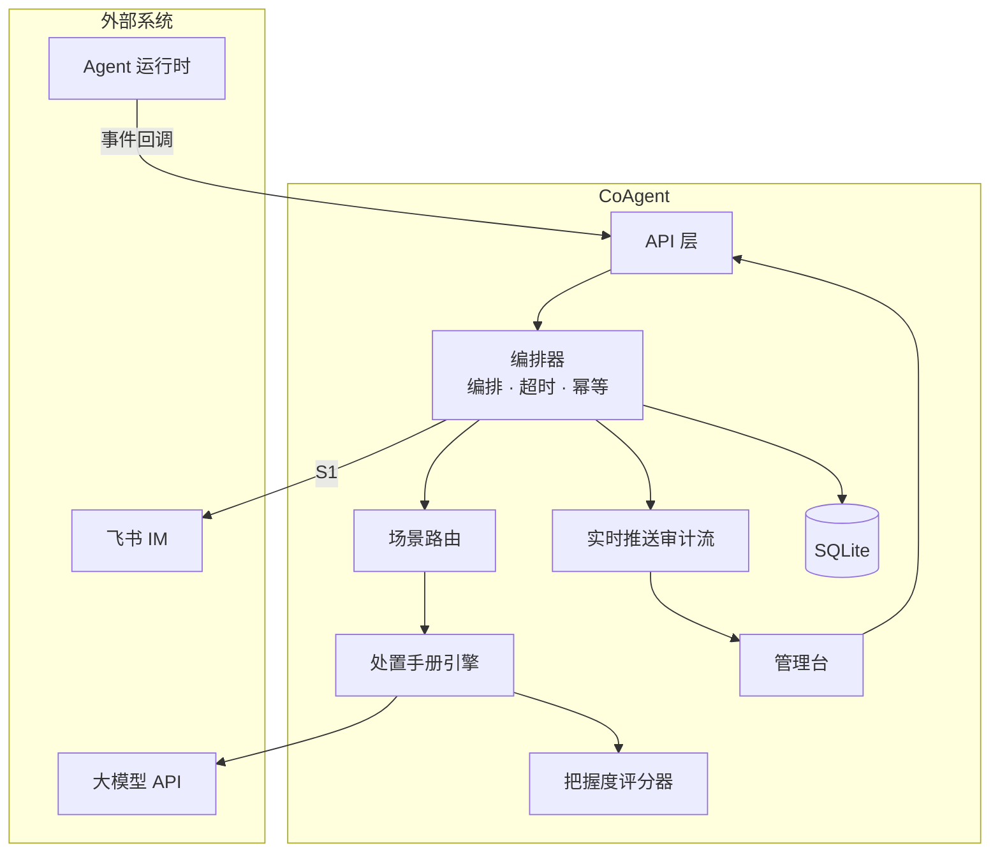

# CoAgent 技术汇报

**主题：** Agent 运维助手架构设计与工程化实践  
**定位：** 面向企业的 Agent 运行态运维 — 不只告警，给出可验证、敢执行的处置方案

---

## 1. 项目亮点

CoAgent 的技术价值不在「堆 Agent 框架」，而在 **Agent 运维层的可验证处置闭环**：

| 亮点 | 说明 |
|------|------|
| **根因推理** | 按处置手册从症状推到原因与影响（限流→不可用、空检索→幻觉、超预算→止血），非基础设施日志关联 |
| **把握度评分** | 数据·手册·推理三因子可验证评分，非大模型自报置信度；🟢🟡🔴 直接定义「敢不敢动」 |
| **人工把关** |评分驱动处置边界：S1 敢重试 · S2 需确认 · S3 必须升级 |
| **全链路审计** | 实时推送时间线 + 持久化留痕，支持回放与团队复盘 |
| **配置驱动** | 处置手册 JSON 单一真相源，改场景不调代码；校准与运行时同源 |
| **优雅降级** | 分层错误处理 —演示界面永不空白，推理不可假、通道可兜底 |

**答辩三件套：** 跨信号 Agent 运维推理 · 每步可验证 · 处置可闭环

---

## 2. 架构总览

### 2.1 系统上下文



### 2.2 统一处置流水线

```
事件接入 → 场景路由 → 处置手册+ 工具 →大模型根因推理 → 把握度评分 → 分级处置 → 审计留痕
```

三场景共用同一流水线，差异在处置手册配置：

| 场景 | 典型症状 |评分分级 | 处置边界 |
|------|----------|----------|----------|
| **S1** | API 限流 / 429 | 🟢 可执行 | 可重试 |
| **S2** | 检索增强 空检索 | 🟡 需确认 | 禁止盲重试 |
| **S3** | Token 超预算 | 🔴 需升级 | 必须升级 @ |

### 2.3 分层设计

| 层级 | 职责 |
|------|------|
| **表现层** | 管理台四标签页：总览 · 场景触发 · 决策详情 · 反馈飞轮 |
| **API 层** | 事件接入、管理台操作、实时推送流、回放 |
| **领域层** | 编排器 · 路由 ·处置手册引擎 ·评分器 · 大模型 · 通道 |
| **基础设施** | 实时推送 · SQLite · 配置与超时预算 |
| **数据层** | 处置手册 JSON · 场景配置 · Agent 元数据 |

---

## 3. 核心设计原则

| 原则 | 工程收益 |
|------|----------|
| **配置驱动** | 运维场景 JSON 化，路由 /评分器 / 引擎同源，避免配置漂移 |
| **可验证推理** |评分公式独立于大模型，零幻觉运维，评委/客户可追问 |
| **人工把关** | 分级驱动界面动作权限，企业「敢用」优先于「自主执行」 |
| **审计优先** | 每步实时推送 +时间线持久化，事故复盘、合规留痕 |
| **异步优先** | 外部 I/O 不阻塞事件循环，实时时间线不断流 |

---

## 4. 工程化要点

### 4.1 把握度评分

```
总分 = round(100 × (0.35×数据 + 0.35×手册 + 0.30×推理))
```

- **数据** — 数据完备度：字段、日志、工具调用成功率  
- **手册** —手册匹配度：事件类型 / 症状 vs 运维标签  
- **推理** — 推理一致性：大模型输出 vs处置手册规则校验  

运维场景零幻觉容忍，**不用大模型自报置信度**。

### 4.2 降级与幂等

- **分层降级：** 工具 → 大模型 → 通道 → 整链，各层独立超时与兜底策略  
- **幂等保护：** 重复事件不重复推理、不重复通知  
- **回放只读：** 审计回放禁止调用大模型 / 外部通道，保证复盘可信  

### 4.3处置手册驱动

处置手册 JSON 定义路由、工具链、运维标签、一致性规则与预期评分区间 — **单一真相源**，改场景即改 JSON。

### 4.4大模型输出约束

结构化校验（影响 · 假设 · 推理链 · 步骤 · 是否建议重试），校验失败重试，**禁止静态内容冒充推理**。

---

## 5. 架构选型（简要）

| 选型 | 理由 |
|------|------|
| **单编排器 + JSON 处置手册** | 黑客松复杂度可控；三场景共用流水线；Ultra 可扩展多 Agent |
| **SQLite** | 零依赖部署；故障事件量级足够；赛后可平滑迁移 |
| **HTMX + 实时推送** | 无前端构建链；服务端渲染；原生推送适合审计时间线 |
| **异步全链路** | 大模型 / 飞书等外部 I/O 不阻塞实时推送 |

---

## 6. 演进路线

| 阶段 | 增量能力 |
|------|----------|
| **Basic**（当前） | 事件 → 处置手册 → 评分 → 人工处置 · 审计 · 飞轮 |
| **Pro** | 运行时纠偏 · 按分级/成本选模型 · 企业审计导出 |
| **Ultra** | 知识图谱 · 历史推演 · 多 Agent 编排 |

当前架构在编排器层预留扩展点，Pro / Ultra 为增量演进，非推倒重来。

---

## 7. 总结

CoAgent 在有限工程周期内实现了 **「敢动手 → 不敢盲动 → 必须升级」** 的完整演示闭环：

1. **处置手册约束的根因推理** — 聚焦 Agent 运行态，非基础设施关联  
2. **可验证把握度评分** — 三因子公式，非大模型自吹  
3. **全链路审计** — 每步可回放、可追问、可迭代  
4. **配置驱动 + 优雅降级** — JSON 单一真相源，分层兜底  
5. **清晰演进路径** — Basic → Pro → Ultra 增量扩展  

**创新内核：** Agent 异常 →根因推理 → 把握度评分可验证 → 人工把关处置 → 飞轮复盘

---

## 相关文档

| 文档 | 说明 |
|------|------|
| [coagent-core-innovations.md](./coagent-core-innovations.md) | 五大核心创新点 |
| [coagent-project-intro.md](./coagent-project-intro.md) | 项目介绍与竞品分析 |
| [coagent-design-spec.md](./superpowers/specs/coagent-design-spec.md) | 实施基线 |
