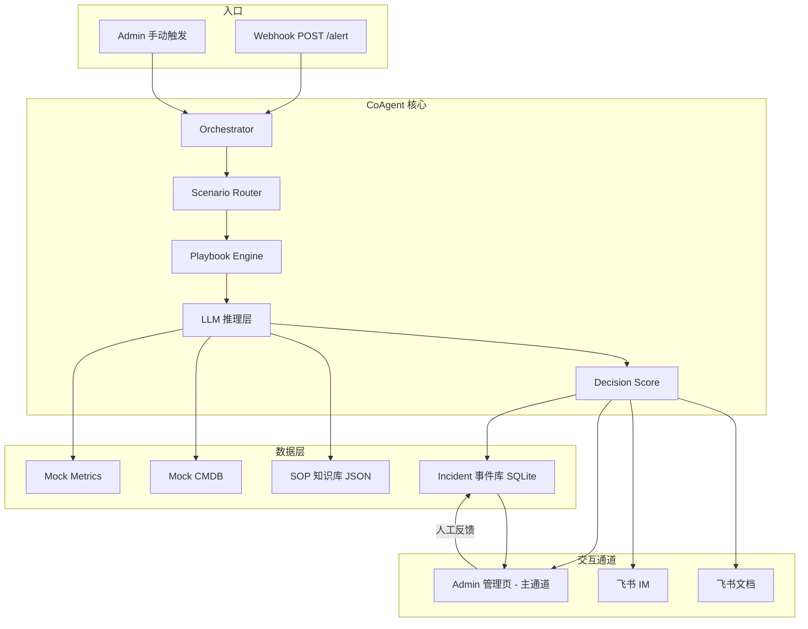
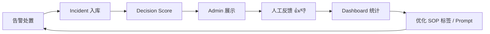

# CoAgent 设计规格说明 v2

> **⚠️ 已被 [v3 统一版](./2026-06-27-coagent-design-v3.md) 替代。v3 合并 Agent Ops 叙事 + 本版工程深度，Hackathon 仅按 v3 实施。**

**日期：** 2026-06-27  
**状态：** 已被 v3 替代  
**版本：** v2.0  
**前置文档：** [2026-06-27-coagent-design.md](./2026-06-27-coagent-design.md)（v1，已 superseded）  
**主题：** ToB 场景 AI Agent — On-call 决策 Copilot + 数据飞轮

---

## 修订摘要（v1 → v2）

| 维度 | v1 | v2 |
|------|----|----|
| 核心价值 | IM 里 Multi-Agent 协作演示 | 缩短决策时间 + 提升决策质量 + 过程数据化飞轮 |
| Agent 模型 | 固定 Triage → Runbook 双 Agent | Scenario Router + 可配置 Playbook（按场景切换，非必须 Multi-Agent） |
| LLM 使用 | 可 fallback 到静态 JSON | **推理层必须真实调用 LLM**；Mock 仅限外部系统数据 |
| 交互主通道 | 飞书 thread | **Admin 管理页**；飞书 IM / 飞书文档为同步出口 |
| 置信度 | LLM 自报 `confidence` | **Decision Score** 三因子可解释评分 |
| Demo 场景 | 1 个 | **3 个主场景**，现场可切换 |
| 统计 | 无 | Dashboard：Score、反馈率、MTTR 代理指标 |

---

## 1. 概述

### 1.1 问题

真实故障场景中，on-call 工程师在 P1 期间需要：

1. **查数据**：跨 Grafana、CMDB、变更系统拼凑上下文——耗时长  
2. **做决策**：在 runbook、on-call 手册、群聊信息间切换——低效且易漏项、误判  
3. **留记录**：处置过程散落 IM，难以复盘与持续改进  

现有工具（PagerDuty、Grafana、Confluence）各自为政，**缺少把「检索 + 推理 + SOP 匹配 + 过程沉淀」串成一条链路的 copilot**。

### 1.2 方案

**CoAgent** 是 on-call 决策 copilot：

- 告警进入后，**Scenario Router** 按业务场景选择 Playbook  
- **LLM 推理层**真实完成影响面判断、根因假设、处置步骤生成（非模板伪造）  
- **Decision Score** 给出可执行的置信评估（数据完备度 + SOP 匹配度 + 推理一致性）  
- **Admin 管理页**作为主交互通道，展示完整决策链路与评分分解  
- 同步至 **飞书 IM**（通知/升级）与 **飞书文档**（incident 时间线材料）  
- 人工反馈写入事件库，**Dashboard 驱动持续迭代飞轮**

### 1.3 一句话 Pitch

> CoAgent：在 P1 发生的 90 秒内，帮值班工程师拿到「该信什么、该做什么、有多把握」，把过程数据化，越用越准。

### 1.4 价值主张（不用「Agent/LLM」表述）

> 帮 on-call 在告警发生后，立刻获得经 SOP 校验的处置建议与把握程度，并留下可追溯记录供团队复盘迭代。

### 1.5 Hackathon 约束

| 约束 | 值 |
|------|-----|
| 团队规模 | 1 人（solo） |
| 时长 | 约 48 小时 |
| 行业 | 无限制 |
| 平台/API | 无限制 |
| 团队背景 | SRE、云计算、IM |

### 1.6 评分对齐

| 维度 | 权重 | v2 如何拿分 |
|------|------|-------------|
| 场景创新性 | 30% | On-call 决策 copilot + Decision Score + 数据飞轮，非通用 chatbot |
| 产品完成度 | 25% | Admin 页完整闭环 + 3 场景可演示 + 通道同步 |
| 技术深度 | 20% | Scenario Router + 真 LLM 推理 + 可解释评分 + 事件数据模型 |
| 商业潜力 | 15% | SRE/平台团队 buyer；MTTR + 决策质量双 ROI |
| Demo 表现 | 10% | Admin 实时 timeline + 场景切换 + 兜底方案 |

---

## 2. 范围

### 2.1 范围内

```
告警入口 → Scenario Router → Playbook Engine → LLM 推理 → Decision Score
    → Admin 管理页（主）→ 同步飞书 IM / 飞书文档
    → 人工反馈 → Dashboard 飞轮
```

**P0（48h 必交付）：**

- Admin 管理页：Incident 台、场景触发、Decision 面板、基础统计  
- 3 个主场景 playbook + mock 外部数据  
- LLM 真实推理（影响面、根因假设、处置步骤）  
- Decision Score 三因子计算与分级动作  
- 场景 1 飞书 IM 卡片同步  
- Demo 兜底（通道层 fallback + 预录视频）  

**P1（时间允许）：**

- 场景 2、3 飞书 IM 同步  
- 飞书文档自动生成 incident 时间线  
- Dashboard 图表 polish  

**P2（pitch 讲述，可不实现）：**

- SOP embedding 语义匹配（v2 先用标签/关键词匹配）  
- 真实 Prometheus/Grafana 对接  

### 2.2 范围外

| 功能 | 原因 |
|------|------|
| 固定 Multi-Agent 编排框架 | 按场景选 Playbook 即可，不强制多 Agent |
| LLM 推理 fallback 到静态 JSON | 推理不可伪造；失败时 Admin 页明确报错 |
| 飞书作为唯一 UI | Admin 页必须独立完成全流程 |
| 通用低代码编排平台 | Hackathon 聚焦 on-call 垂直场景 |
| 多种 IM 平台 | 飞书足够；路线图再扩展 |

---

## 3. 架构



### 3.1 组件职责

| 组件 | 职责 |
|------|------|
| **Orchestrator** | 编排全流程；分配 `trace_id`；持久化 incident；处理通道层 fallback |
| **Scenario Router** | 根据 `symptom` / `service` 选择 playbook 与 tool 集 |
| **Playbook Engine** | 加载场景配置：prompt 模板、应调 tools、SOP 标签、评分权重 |
| **LLM 推理层** | 真实调用 LLM：影响面、根因假设、处置步骤、同步文案 |
| **Decision Score** | 三因子评分 + 分级动作 |
| **Admin 管理页** | 主交互：触发、timeline、Score 分解、反馈、统计 |
| **飞书 IM** | 同步出口：告警卡片、Score 摘要、升级 @ |
| **飞书文档** | 同步出口：incident 结构化时间线（P1） |

### 3.2 技术栈

| 层 | 选型 |
|----|------|
| 后端 | Python 3.11+ / FastAPI |
| 前端 | 简单 SPA 或 FastAPI + HTMX（solo 求快） |
| 数据库 | SQLite（incident + 反馈 + 统计） |
| LLM | OpenAI 兼容 API + Tool calling |
| IM | 飞书官方 SDK |
| 文档 | 飞书 Doc API（P1） |
| Mock 数据 | 本地 JSON |

### 3.3 项目结构

```
coagent/
├── app/
│   ├── main.py                 # FastAPI 入口
│   ├── orchestrator.py
│   ├── router.py               # Scenario Router
│   ├── playbooks/              # 三场景配置
│   │   ├── payment_5xx.yaml
│   │   ├── redis_memory.yaml
│   │   └── post_deploy.yaml
│   ├── llm/                    # 推理层 + prompt
│   ├── scoring/                # Decision Score
│   ├── tools/                  # Mock metrics/cmdb/sop
│   ├── channels/
│   │   ├── feishu_im.py
│   │   └── feishu_doc.py       # P1
│   ├── models/                 # SQLAlchemy / pydantic
│   └── api/                    # REST for Admin
├── web/                        # Admin 前端
│   ├── index.html
│   └── static/
├── data/
│   ├── sops.json
│   ├── services.json
│   ├── scenarios/              # 三场景 demo payload
│   └── calibration/            # calibrate_scores.sh 输出
├── scripts/
│   ├── demo.sh
│   └── calibrate_scores.sh
├── .env.example
└── README.md
```

---

## 4. 三场景矩阵

| ID | 场景名 | symptom | service 示例 | SOP | Demo 设计意图 |
|----|--------|---------|-------------|-----|---------------|
| S1 | 支付 5xx 突增 | `5xx_rate_spike` | payment-api | SOP-042 | Score 高（≥80），🟢 可执行 |
| S2 | Redis 内存打满 | `redis_memory_high` | order-cache | SOP-017 | Score 中（60–79），🟡 需确认 |
| S3 | 发布后错误率上升 | `error_rate_post_deploy` | checkout-api | SOP-089 | Score 低（<60），🔴 建议升级 |

每个场景包含：

- `demo-alert.json` — webhook payload  
- playbook YAML — prompt、tools、SOP 标签  
- mock tool 返回值 — 与场景叙事一致  

**Router 规则（v2 简单实现）：**

```python
ROUTES = {
    "5xx_rate_spike": "payment_5xx",
    "redis_memory_high": "redis_memory",
    "error_rate_post_deploy": "post_deploy",
}
```

---

## 5. 数据模型

### 5.1 告警输入

```json
{
  "alert_id": "demo-001",
  "severity": "P1",
  "service": "payment-api",
  "symptom": "5xx_rate_spike",
  "value": "12.3%",
  "baseline": "0.5%",
  "started_at": "2026-06-27T10:42:00+08:00",
  "grafana_link": "https://grafana.example/d/payment",
  "change_id": null
}
```

S3 场景额外携带 `"change_id": "deploy-8821"`。

### 5.2 LLM 推理输出（必须 LLM 生成，结构固定）

```json
{
  "impact": "string — 影响面描述",
  "affected_deps": ["string"],
  "hypothesis": ["string — 根因假设，至少 1 条"],
  "reasoning_chain": ["string — 逐步推理，供 Admin timeline 展示"],
  "steps": [
    {
      "order": 1,
      "action": "string",
      "command": "string | null",
      "risk": "low | medium | high"
    }
  ],
  "comms_draft": "string — 同步文案"
}
```

**禁止：** 用静态 JSON 替代上述字段内容（fallback 见 §8）。

### 5.3 Decision Score 输出

```json
{
  "total": 82,
  "grade": "executable",
  "factors": {
    "data_completeness": 0.90,
    "sop_match": 0.85,
    "reasoning_consistency": 0.70
  },
  "labels": {
    "grade_display": "🟢 可执行",
    "action_hint": "建议按此步骤执行，仍需人工确认高风险操作"
  }
}
```

`grade` 枚举：`executable` | `needs_confirmation` | `escalate`

### 5.4 Incident 持久化（SQLite）

```sql
CREATE TABLE incidents (
  id            INTEGER PRIMARY KEY AUTOINCREMENT,
  trace_id      TEXT NOT NULL UNIQUE,
  alert_id      TEXT NOT NULL,
  scenario_id   TEXT NOT NULL,
  status        TEXT NOT NULL,  -- pending | running | completed | failed
  llm_json      TEXT,           -- §5.2 推理输出 JSON
  score_json    TEXT,           -- §5.3 Score JSON
  timeline_json TEXT,           -- SSE 事件序列快照（可选）
  started_at    TEXT NOT NULL,
  completed_at  TEXT,
  feishu_msg_id TEXT,
  doc_url       TEXT,
  duration_ms   INTEGER
);

CREATE TABLE feedback (
  id          INTEGER PRIMARY KEY AUTOINCREMENT,
  incident_id INTEGER NOT NULL REFERENCES incidents(id),
  rating      TEXT NOT NULL,    -- up | down
  comment     TEXT,
  created_at  TEXT NOT NULL
);
```

---

## 6. Decision Score 执行度评估

### 6.1 公式

```
Decision Score = round(100 × (
    0.35 × data_completeness +
    0.35 × sop_match +
    0.30 × reasoning_consistency
))
```

### 6.2 因子定义

| 因子 | 计算 | 说明 |
|------|------|------|
| **data_completeness** | 成功 tool 数 / playbook 要求 tool 数；关键字段非空 | 外部数据是否齐备 |
| **sop_match** | symptom+service 标签与 SOP 标签交集 / 期望标签数；P2 可换 embedding | SOP 是否找对 |
| **reasoning_consistency** | 规则校验：hypothesis 关键词是否出现在 metrics 异常描述中；steps 是否引用 SOP 中的 action | 推理是否自洽 |

### 6.3 分级动作

| 分数 | grade | Admin 展示 | 飞书动作 |
|------|-------|-----------|----------|
| ≥ 80 | executable | 🟢 可执行 | 卡片标注 Score + 步骤 |
| 60–79 | needs_confirmation | 🟡 需人工确认 | 卡片强调「请值班负责人确认」 |
| < 60 | escalate | 🔴 建议升级 | @oncall-lead（配置 FEISHU_ESCALATE_USER_ID） |

### 6.4 与 v1 `confidence` 的区别

- v1：`confidence` 由 LLM 自报，不可验证  
- v2：Score 由**可观测因子**计算，Admin 页展示分解，评委可追问公式  

### 6.5 场景预期 Score 区间（Demo 校准目标）

| 场景 | scenario_id | 预期 total | 预期 grade |
|------|-------------|-----------|------------|
| S1 支付 5xx | `payment_5xx` | 82–88 | executable |
| S2 Redis 内存 | `redis_memory` | 65–75 | needs_confirmation |
| S3 发布后错误 | `post_deploy` | 50–58 | escalate |

### 6.6 Demo 校准与 `DEMO_MODE` clamp

**校准流程（兜底阶段预留 2h，见 §13）：**

1. 运行 `scripts/calibrate_scores.sh`（或等效命令），对每个 playbook 调用 LLM **10 次**  
2. 输出 `data/calibration/{scenario_id}.json`：total 的 min/max/avg 与三因子分布  
3. 未命中 §6.5 区间 → 调整 mock 数据、SOP 标签、consistency 规则关键词，重复步骤 1  

**`scripts/calibrate_scores.sh` 行为：**

```bash
# 用法示例
./scripts/calibrate_scores.sh --scenario payment_5xx --runs 10
# 输出: data/calibration/payment_5xx.json
```

**`DEMO_MODE=true` 时的 Score 稳定策略（不伪造 LLM 文本）：**

| 项 | 行为 |
|----|------|
| LLM 输出 | 仍真实生成 `impact` / `hypothesis` / `steps` / `reasoning_chain` |
| `reasoning_consistency` | 计算后按 playbook YAML 中 `consistency_clamp: [min, max]` **clamp** 到区间 |
| `data_completeness` / `sop_match` | 不 clamp；靠 mock 数据保证稳定 |
| Admin 展示 | Score 分解旁标注「Demo 模式 · consistency 已校准」 |
| LLM 完全失败 | 不读静态 hypothesis；走 §8.1 L0 + Replay |

**Playbook YAML 补充字段示例：**

```yaml
consistency_clamp: [0.68, 0.75]   # S1 示例，使 total 落在 82–88
expected_score: [82, 88]
expected_grade: executable
```

---

## 7. Playbook Engine（替代固定 Multi-Agent）

### 7.1 设计原则

- **不强制 Multi-Agent**；每个场景一个 playbook，内部可配置 1–N 步 LLM 调用  
- v2 默认：**单 LLM 调用 + 强制 tool use**，输出完整推理结果  
- 若某场景需要两步（如先 triage 再 runbook），在 playbook YAML 中声明，而非全局固定  

### 7.2 Playbook YAML 示例（S1）

```yaml
id: payment_5xx
name: 支付 5xx 突增
sop_id: SOP-042
sop_tags: [5xx, payment, database]
required_tools:
  - query_metrics
  - query_service_meta
  - search_sop
prompt_template: prompts/payment_5xx.md
score_weights:
  data_completeness: 0.35
  sop_match: 0.35
  reasoning_consistency: 0.30
```

### 7.3 LLM 调用约束

1. 必须先完成 `required_tools` 全部调用  
2. 输出必须符合 §5.2 JSON schema  
3. `reasoning_chain` 至少 3 步，供 Admin timeline 展示  
4. 禁止输出 playbook / SOP 未涵盖的高风险操作（rollout restart 仅在 SOP 允许时出现）  

---

## 8. 错误处理与 Demo 兜底

### 8.1 分层策略

| 层级 | 失败对象 | 行为 |
|------|----------|------|
| **L0 推理** | LLM 超时 / 非法 JSON | 每 playbook 重试 2 次 → Admin 页显示「推理失败，请重试」；**不伪造 hypothesis** |
| **L1 工具** | Mock tool 异常 | 硬编码降级数据；`data_completeness` 因子下降，Score 反映不确定性 |
| **L2 通道** | 飞书 IM / 文档 API 失败 | 重试 2 次 → Admin 页完整展示；写 `demo.log` |
| **L3 现场** | 网络 / LLM 不可用 | Admin **Replay 模式**播放最近成功 incident + 预录 30s 视频 |

### 8.2 Demo 铁律

- Admin 页**永不空白**：至少有 timeline 占位或明确错误态  
- 飞书失败不影响 Admin 主流程  
- Pitch 中如实说明：「推理必须真实；通道层有兜底」  

### 8.4 Admin UI 错误态（与 L0–L3 映射）

| 层级 | Tab1 Timeline | Tab3 Decision | Tab4 统计 | 用户可见文案 |
|------|---------------|---------------|-----------|-------------|
| L0 推理失败 | 红色条目「推理失败」 | 灰色占位 + 重试按钮 | 不计入平均 Score | 「LLM 不可用，请重试或 Replay」 |
| L1 工具降级 | 黄色 warning + tool 结果 | Score 下降，因子可展开 | 正常计入 | 「部分数据降级，Score 已反映不确定性」 |
| L2 飞书失败 | 通道状态 ❌ 飞书 | 不影响 Score | 不影响 | 「Admin 完整可用；飞书同步失败」 |
| L3 Replay | 回放历史 timeline（只读） | 历史 Score 只读 | 只读 | 「Replay 模式 · trace_id: xxx」 |

**铁律：** L0 禁止展示伪造的 `hypothesis` / `steps`；仅允许 Replay **已成功入库** 的历史 incident。

---

## 9. Admin 管理页

### 9.1 主通道定位

Admin 页必须能**独立完成**以下操作，不依赖飞书：

- 选择场景 / 触发告警  
- 查看实时决策 timeline  
- 查看 Decision Score 分解  
- 提交人工反馈  
- 查看历史 incident 与统计  

飞书 IM / 文档 = **同步出口**，不是唯一 UI。

### 9.2 页面结构（4 Tab）

#### Tab 1 — Incident 台

- 左侧：incident 列表（status、scenario、Score、时间）  
- 右侧：当前 incident **实时 timeline**  
  - 告警摘要 → tool 调用结果 → reasoning_chain → steps → Score → 通道同步状态  

#### Tab 2 — 场景触发

- 3 张场景卡片（S1/S2/S3）+ 一键触发  
- 显示预期 Score 区间（demo 脚本用）  
- 高级：自定义 JSON webhook  

#### Tab 3 — Decision 面板

- 当前 incident Score 总分 + 三因子条形图  
- grade 标签 + action_hint  
- 原始 metrics / SOP 匹配详情（可展开）  

#### Tab 4 — 统计飞轮

- 总 incident 数  
- 平均 Decision Score  
- 人工反馈 👍/👎 率  
- 平均处置耗时（`duration_ms` 代理 MTTR 决策段）  
- 按场景分布（简单柱状）  

### 9.3 API 端点（最小集）

| 方法 | 路径 | 说明 |
|------|------|------|
| POST | `/alert` | Webhook 入口 |
| POST | `/admin/trigger/{scenario_id}` | Admin 触发 |
| GET | `/admin/incidents` | 列表 |
| GET | `/admin/incidents/{trace_id}` | 详情 + timeline |
| GET | `/admin/incidents/{trace_id}/stream` | SSE 实时更新（可选） |
| POST | `/admin/incidents/{trace_id}/feedback` | 人工反馈 |
| GET | `/admin/stats` | Dashboard 数据 |
| POST | `/admin/replay/{trace_id}` | Replay 模式 |

### 9.4 SSE 事件协议

**端点：** `GET /admin/incidents/{trace_id}/stream`  
**格式：** `text/event-stream`，每条事件一行 JSON：

```
event: incident
data: {"type":"<event_type>","trace_id":"...","ts":"ISO8601","payload":{...}}
```

| event_type | 触发时机 | payload 要点 |
|------------|----------|-------------|
| `incident_started` | Orchestrator 开始 | `scenario_id`, `alert` 摘要 |
| `tool_called` | 每个 mock tool 完成 | `tool`, `status`, `summary` |
| `llm_reasoning` | LLM 返回 reasoning_chain | `steps[]` 字符串数组 |
| `llm_result` | LLM 完整 JSON 就绪 | `impact`, `hypothesis`, `steps` |
| `score_computed` | Decision Score 完成 | `total`, `grade`, `factors` |
| `channel_sync` | 飞书/文档尝试后 | `channel`, `status`, `detail` |
| `incident_completed` | 全流程结束 | `duration_ms`, `demo_mode` |
| `incident_failed` | L0 推理失败 | `error`, `retryable: true` |

**HTMX 用法：** Tab1 通过 `hx-ext="sse"` 订阅 stream；收到 `score_computed` 时 `HX-Trigger` 刷新 Tab3。

---

## 10. 飞书通道

### 10.1 飞书 IM（P0：S1；P1：S2/S3）

**消息结构（简化）：**

1. **告警卡片** — severity、service、symptom、Score 预告  
2. **处置卡片** — Top 3 steps + Decision Score + grade 标签  
3. **升级 @** — 仅 `grade=escalate` 时  

Admin 页为主；飞书消息从 incident 记录**渲染**，非独立数据源。

### 10.2 飞书文档（P1）

incident 完成后，写入结构化文档：

- 告警摘要  
- reasoning_chain 全文  
- steps + Score 分解  
- 人工反馈（若有）  

文档 URL 回写 `incidents.doc_url`，Admin 可跳转。

---

## 11. 数据飞轮



**Hackathon 可演示的飞轮闭环：**

1. 现场触发 S1 → Score 82 → 👍  
2. 触发 S2 → Score 68 → 🟡 需确认（Pitch 可简略带过）  
3. 触发 S3 → Score 55 → 👎「根因不准」  
4. Dashboard 显示 3 条 incident、平均 Score、反馈率更新  
5. Pitch：「生产环境用反馈校准 SOP 标签与 prompt」  

---

## 12. Demo 计划

### 12.1 现场脚本（5 分钟）

| 时间 | 动作 |
|------|------|
| 0:00 | 问题：查数据 + 决策慢；runbook 散落 |
| 0:30 | Admin Tab2 触发 **S1** → Tab1 timeline 实时滚动 |
| 1:15 | Tab3 Decision Score 分解 → 🟢 可执行（82+） |
| 1:35 | Tab2 触发 **S2** → Tab3 展示 🟡 需确认（65–75） |
| 2:00 | Tab2 触发 **S3** → Tab3 Score 🔴 建议升级（<60） |
| 2:35 | Tab4 提交 👎 反馈 → 统计数字更新 |
| 3:00 | Tab4 Dashboard：3 条 incident + 平均 Score + 反馈率 |
| 3:30 | 飞书 S1 卡片截图（若有；失败则 slide） |
| 4:30 | 商业 + 飞轮 |
| 5:00 | Q&A |

**Pitch 主镜头：** S1（深）→ S3（升级分级）必演；S2 至少触发一次展示 🟡 档位。

### 12.2 兜底

- `scripts/demo.sh` 触发 S1  
- `scripts/calibrate_scores.sh` Demo 前跑通三场景  
- Admin Replay 最近成功 incident  
- 预录 30s 视频（Admin 三场景 + 飞书）  
- LLM 失败：**不伪造假推理**；切 Replay / 视频  

---

## 13. Solo 48h 时间线

| 阶段 | 时间 | 交付 |
|------|------|------|
| 骨架 | 0–5h | FastAPI + SQLite + Admin 空壳 |
| 核心推理 | 5–14h | Router + Playbook S1 + 真 LLM + tools |
| Score | 14–18h | Decision Score 三因子 |
| Admin UI | 18–26h | Incident 台 + 触发 + Decision 面板 |
| 场景 2/3 | 26–32h | 两个 playbook + mock 数据 |
| 飞书 S1 | 32–36h | IM 卡片同步 |
| 飞轮 | 36–40h | 反馈 + Dashboard + **Score 校准 10 次/clamp** |
| 兜底 | 40–44h | Replay + demo.sh + calibrate_scores + 预录 |
| Pitch | 44–48h | Deck + 排练 |

---

## 14. 配置

```env
# LLM
LLM_API_KEY=
LLM_BASE_URL=
LLM_MODEL=gpt-4o-mini

# 飞书
FEISHU_APP_ID=
FEISHU_APP_SECRET=
FEISHU_CHAT_ID=
FEISHU_ESCALATE_USER_ID=

# Admin
ADMIN_HOST=0.0.0.0
ADMIN_PORT=8000

# Demo
DEMO_MODE=true
```

**DEMO_MODE=true：**

- 结束态标注「Demo 模式」  
- 通道层失败允许 Replay  
- **不跳过 LLM 推理**  
- **`reasoning_consistency` 按 playbook `consistency_clamp` 做数值 clamp**（见 §6.6）  

---

## 15. Pitch Deck（5 页）

| 页 | 标题 | 要点 |
|----|------|------|
| 1 | 问题 | 查数据慢 + 决策慢；runbook 低效不准 |
| 2 | CoAgent | 决策 copilot；Decision Score；Admin + IM + 文档 |
| 3 | Live Demo | 3 场景切换 + Score 分级 + 飞轮 |
| 4 | 技术 | Router + Playbook + 真 LLM + 可解释 Score |
| 5 | 商业 | SRE buyer；MTTR + 决策质量；飞轮迭代 |

---

## 16. 验收标准

- [ ] Admin 页可触发 S1/S2/S3 并展示完整 timeline  
- [ ] LLM 推理真实生成 impact / hypothesis / steps（非静态文件）  
- [ ] Decision Score 三因子可展示；S1/S3 total 与 grade 符合 §6.5（或 clamp 生效）
- [ ] S2 触发后 grade 为 needs_confirmation（65–75 区间或 clamp 生效）
- [ ] `scripts/calibrate_scores.sh` 三场景预跑通过（见 §6.6）
- [ ] S1 飞书 IM 同步成功  
- [ ] 人工反馈写入 DB，Dashboard 统计更新  
- [ ] LLM 失败时 Admin 显示错误态（不伪造推理）  
- [ ] Replay / 预录视频兜底可用  
- [ ] `scripts/demo.sh` 连续 10 次 S1 稳定  

---

## 17. 后续路线图

- 飞书文档全自动时间线（P1 完善）  
- SOP embedding 语义检索  
- 真实 Prometheus / Grafana / CMDB 对接  
- Playbook 可视化编辑  
- 多 IM 平台（Slack、企业微信）  
- 基于反馈自动调权重 / prompt A-B  

---

## 18. v1 文档处置

[v1 spec](./2026-06-27-coagent-design.md) 保留作历史参考，**一切实现以本文档 v2 为准**。
