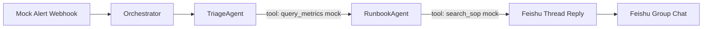
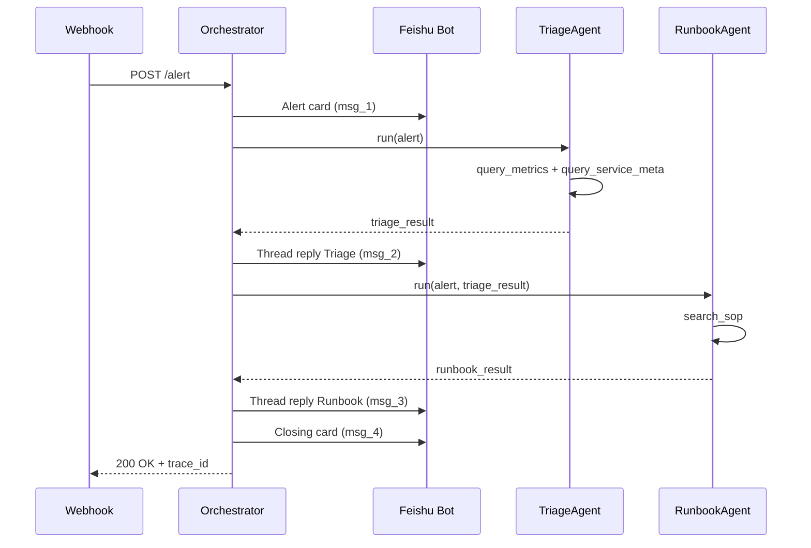

# CoAgent Design Spec

**Date:** 2026-06-27  
**Status:** Approved  
**Author:** Hackathon solo design  
**Theme:** ToB Scenario AI Agent — IM-native SRE War Room

---

## 1. Overview

### 1.1 Problem

On-call SRE engineers face information overload when P1 alerts fire. New responders struggle to triage quickly, runbooks are scattered, and context switching across monitoring tools slows mean-time-to-recovery (MTTR).

### 1.2 Solution

**CoAgent** is a Feishu-native SRE war room. When an alert arrives, two specialist agents collaborate in an IM thread: one triages impact and root-cause hypotheses, the other matches runbooks and outputs executable steps plus a comms draft.

### 1.3 Pitch (One Sentence)

> CoAgent: alerts enter Feishu; two agents collaborate in-thread—one triages impact, one delivers runbook commands—cutting novice on-call decision time from 30 minutes to 3 minutes.

### 1.4 Hackathon Constraints

| Constraint | Value |
|------------|-------|
| Team size | 1 (solo) |
| Duration | ~48 hours |
| Industry | No restriction |
| Platform/API | No restriction |
| IM platform | Feishu (飞书) |
| Team background | SRE, cloud computing, IM |

### 1.5 Scoring Alignment

| Dimension | Weight | How CoAgent Scores |
|-----------|--------|-------------------|
| Scenario innovation | 30% | Event-driven multi-agent workflow in IM, not generic chatbot |
| Product completion | 25% | Single end-to-end demo path, fully runnable |
| Technical depth | 20% | Orchestrator + tool calling + mock CMDB/SOP with real interfaces |
| Commercial potential | 15% | Clear buyer (SRE/platform teams), MTTR ROI story |
| Demo performance | 10% | Feishu thread timeline + `demo.sh` + backup video |

---

## 2. Scope

### 2.1 In Scope

```
Mock Alert → Feishu Card → TriageAgent → RunbookAgent → Thread Replies (commands + comms draft)
```

- One alert type: `payment-api` 5xx rate spike
- Two agents in linear pipeline: TriageAgent → RunbookAgent
- Feishu interactive card + 3 thread replies + closing card (4 messages total)
- Mock tools: metrics, service metadata, SOP search
- Fallback JSON when LLM fails
- One-click demo script (`scripts/demo.sh`)

### 2.2 Out of Scope

| Feature | Reason |
|---------|--------|
| Third CommsAgent | Merged into RunbookAgent output |
| Agent trace visualization UI | IM timeline is sufficient for solo 48h |
| Generic workflow platform | Hardcoded 2-step pipeline |
| Real Prometheus/Grafana integration | Mock webhook for demo stability |
| Multiple alert types | Focus on one polished demo path |

---

## 3. Architecture



### 3.1 Components

| Component | Responsibility |
|-----------|----------------|
| Webhook entry (`POST /alert`) | Receive fixed JSON alert, validate, forward to orchestrator |
| Orchestrator | Linear agent pipeline; assign `trace_id`; handle fallback |
| TriageAgent | Impact assessment, hypothesis, escalation flag |
| RunbookAgent | SOP match, executable steps, comms draft |
| Feishu Bot | Send card + thread replies |

### 3.2 Tech Stack

- **Runtime:** Python 3.11+
- **HTTP:** FastAPI
- **IM:** Feishu official SDK
- **LLM:** OpenAI-compatible API with tool calling
- **Data:** Local JSON files (`data/sops.json`, `data/services.json`, `data/fallback/`)

### 3.3 Project Structure

```
coagent/
├── app/
│   ├── main.py           # FastAPI webhook
│   ├── orchestrator.py   # Linear pipeline
│   ├── agents/
│   │   ├── triage.py
│   │   └── runbook.py
│   ├── tools/            # Mock implementations
│   └── feishu/           # Bot client + card builder
├── data/
│   ├── sops.json
│   ├── services.json
│   ├── demo-alert.json
│   └── fallback/
│       ├── triage.json
│       └── runbook.json
├── scripts/
│   └── demo.sh           # One-click demo trigger
├── .env.example
└── README.md
```

---

## 4. Data Models

### 4.1 Alert Input (Webhook Payload)

Demo supports one fixed alert shape:

```json
{
  "alert_id": "demo-001",
  "severity": "P1",
  "service": "payment-api",
  "symptom": "5xx_rate_spike",
  "value": "12.3%",
  "baseline": "0.5%",
  "started_at": "2026-06-27T10:42:00+08:00",
  "grafana_link": "https://grafana.example/d/payment"
}
```

Orchestrator validates and normalizes; no LLM involved at this stage.

### 4.2 TriageAgent Output

```json
{
  "impact": "payment-api 5xx 异常，影响核心支付链路",
  "affected_deps": ["order-db"],
  "hypothesis": ["DB 连接池耗尽", "下游 redis 超时"],
  "confidence": 0.87,
  "escalate": false
}
```

### 4.3 RunbookAgent Output

```json
{
  "sop_id": "SOP-042",
  "steps": [
    {
      "order": 1,
      "action": "检查 order-db 连接池",
      "command": "kubectl top pods -n payment",
      "risk": "low"
    },
    {
      "order": 2,
      "action": "若 conn > 90%，重启 payment-api 非核心 pod",
      "command": "kubectl rollout restart deploy/payment-api -n payment",
      "risk": "medium"
    }
  ],
  "comms_draft": "【P1】payment 服务 5xx 异常，正在处置，预计影响在线支付，更新于 HH:MM"
}
```

---

## 5. Agent Design

### 5.1 TriageAgent

**Responsibilities:**
- Assess impact scope
- Generate root-cause hypotheses
- Decide escalation flag

**Must NOT:**
- Provide kubectl commands
- Search SOPs
- Write external notifications

**System Prompt Guidelines:**
- Role: SRE triage specialist
- Output: structured JSON only
- Must call `query_metrics` and `query_service_meta` before concluding
- Set `escalate: true` when confidence < 0.7

**Tools (Mock):**

| Tool | Input | Mock Return |
|------|-------|-------------|
| `query_metrics` | `service`, `window=15m` | 5xx=12.3%, QPS=8.2k, p99=2.1s |
| `query_service_meta` | `service` | tier=P0, owner=@张三, deps=[order-db, redis-cache] |

### 5.2 RunbookAgent

**Responsibilities:**
- Match SOP from knowledge base
- Generate numbered executable steps with commands
- Draft sync/comms message

**Must NOT:**
- Re-triage or change impact assessment

**System Prompt Guidelines:**
- Input: original alert + TriageAgent output
- Must call `search_sop` before generating steps
- Steps must be numbered with risk labels

**Tools (Mock):**

| Tool | Input | Mock Return |
|------|-------|-------------|
| `search_sop` | `symptom=5xx_rate_spike`, `service=payment-api` | SOP-042 summary from `data/sops.json` |

---

## 6. Feishu Message Format

### 6.1 Message 1 — Alert Card

```
🔴 P1 告警 | payment-api 5xx 突增
━━━━━━━━━━━━━━━━━━━━
指标：5xx 12.3%（基线 0.5%）
时间：10:42 起
CoAgent 已接手，正在 Triage...
[查看 Grafana]（可点击链接）
```

### 6.2 Message 2 — Thread: TriageAgent

```
🤖 TriageAgent
影响：核心支付链路
假设：DB 连接池 / Redis 超时（置信度 87%）
依赖：order-db
→ 移交 RunbookAgent
```

### 6.3 Message 3 — Thread: RunbookAgent

```
🤖 RunbookAgent | SOP-042
1. [低] 检查 order-db 连接池
   kubectl top pods -n payment
2. [中] 必要时 rollout restart
   kubectl rollout restart deploy/payment-api -n payment

📋 同步文案（可复制）：
【P1】payment 服务 5xx 异常...
```

### 6.4 Message 4 — Closing Card

```
✅ CoAgent 处置建议已生成 | 耗时 8s
（Demo 模式：Mock 告警 demo-001）
```

Thread replies attach to Message 1 via Feishu reply API.

---

## 7. Orchestrator Flow



**Rules:**
- Single `trace_id` for entire pipeline; included in logs and Feishu footer
- Any step failure → fallback JSON; still send all 4 messages
- Per-step LLM timeout: 15 seconds
- End-to-end target: < 30 seconds (typical ~8s for pitch)

---

## 8. Error Handling

| Priority | Scenario | Behavior |
|----------|----------|----------|
| P0 | LLM returns invalid JSON | Retry once → read fallback JSON |
| P0 | Feishu send fails | Retry 2x with exponential backoff → write `demo.log` |
| P1 | Tool call exception | Use hardcoded mock data; do not interrupt pipeline |
| P2 | Duplicate `alert_id` | Idempotent: ignore duplicates within 10 minutes |

**Demo rule:** Never show empty thread. Fallback results are acceptable; mention in pitch as production safety net.

---

## 9. Configuration

```env
FEISHU_APP_ID=
FEISHU_APP_SECRET=
FEISHU_CHAT_ID=
LLM_API_KEY=
LLM_BASE_URL=
DEMO_MODE=true
```

Use `.env` locally; never commit secrets.

---

## 10. Demo Plan

### 10.1 Live Demo Script (5 minutes)

| Time | Action |
|------|--------|
| 0:00 | Problem: on-call overload, scattered runbooks |
| 0:30 | Run `scripts/demo.sh` — curl hits webhook |
| 1:00 | Switch to Feishu — alert card appears |
| 1:30 | TriageAgent thread reply |
| 2:30 | RunbookAgent thread reply with commands |
| 3:30 | Closing card; mention 8s typical latency |
| 4:30 | Commercial: MTTR reduction, SRE team buyer |
| 5:00 | Q&A |

### 10.2 Backup

- Pre-recorded 30s video of full Feishu thread
- `demo.log` fallback if Feishu API fails on stage

### 10.3 One-Click Trigger

```bash
curl -X POST http://localhost:8000/alert \
  -H "Content-Type: application/json" \
  -d @data/demo-alert.json
```

---

## 11. Pitch Deck (5 Slides)

| Slide | Title | Content |
|-------|-------|---------|
| 1 | Problem | On-call info overload; novice hesitation; scattered runbooks |
| 2 | CoAgent | IM-native war room; Feishu thread collaboration; Triage + Runbook agents |
| 3 | Live Demo | Feishu thread screenshots; 30s to actionable runbook |
| 4 | Architecture | Component diagram; multi-agent + tool use; mock→real API path |
| 5 | Business & Roadmap | Buyer: SRE/platform; ROI: MTTR; V2: Prometheus, Postmortem agent |

---

## 12. Solo 48h Timeline

| Phase | Hours | Deliverable |
|-------|-------|-------------|
| Scaffold | 0–6 | Webhook + Feishu messaging works |
| Agent 1 | 6–14 | TriageAgent + mock metrics tools |
| Agent 2 | 14–22 | RunbookAgent + mock SOP search |
| Integration | 22–30 | End-to-end + fixed demo data |
| Polish | 30–38 | Error handling, fallback, retries |
| Pitch | 38–48 | 5-slide deck + backup video + 3 rehearsals |

---

## 13. Future Roadmap (Post-Hackathon)

- Connect real Prometheus/Grafana webhooks
- Third agent: auto-generate postmortem from thread
- Support multiple IM platforms (Slack, WeCom)
- Configurable SOP knowledge base with RAG

---

## 14. Success Criteria

- [ ] `POST /alert` with demo payload triggers full Feishu thread (4 messages)
- [ ] TriageAgent calls both mock tools and returns valid JSON
- [ ] RunbookAgent calls SOP search and returns steps + comms draft
- [ ] Pipeline completes in < 30s or falls back gracefully
- [ ] `scripts/demo.sh` works reliably after 10 consecutive runs
- [ ] 5-slide pitch deck ready with backup video
