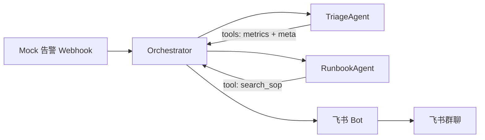
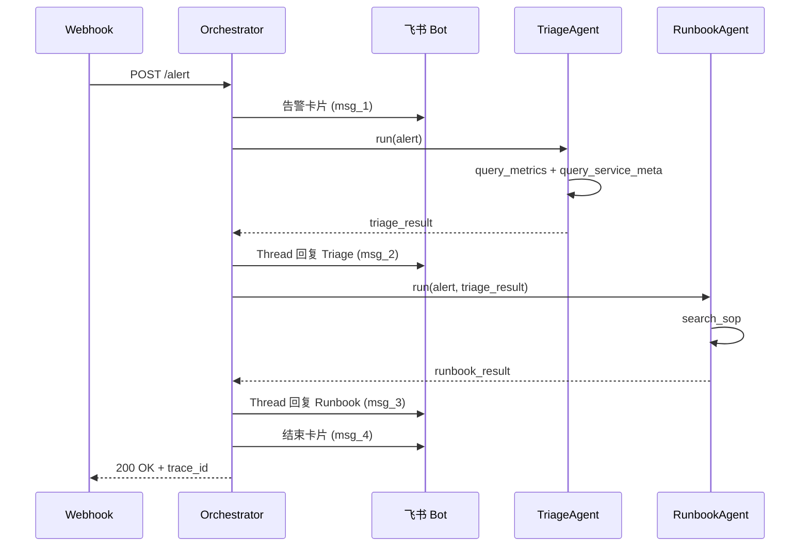

# CoAgent 设计规格说明（v1，已 superseded）

> **⚠️ 本文档已被 [v2](./2026-06-27-coagent-design-v2.md) 替代，请勿按 v1 实现。**

**日期：** 2026-06-27  
**状态：** 已被 v2 替代  
**作者：** Hackathon Solo 设计  
**主题：** ToB 场景 AI Agent — 飞书原生 SRE 值班室

---

## 1. 概述

### 1.1 问题

P1 告警触发时，on-call SRE 面临信息过载：新人难以快速 triage，runbook 分散在各处，在多个监控工具间切换会拖长 MTTR（平均恢复时间）。

### 1.2 方案

**CoAgent** 是飞书原生的 SRE 值班室。告警到达后，两个 Specialist Agent 在 IM 线程中协作：一个负责判影响面与根因假设，另一个匹配 runbook 并输出可执行步骤与同步文案。

### 1.3 一句话 Pitch

> CoAgent：告警进飞书，两个 Agent 在 thread 里协作——一个判影响面，一个给 runbook 命令——把新人 on-call 的决策时间从 30 分钟压到 3 分钟。

### 1.4 Hackathon 约束

| 约束 | 值 |
|------|-----|
| 团队规模 | 1 人（solo） |
| 时长 | 约 48 小时 |
| 行业 | 无限制 |
| 平台/API | 无限制 |
| IM 平台 | 飞书 |
| 团队背景 | SRE、云计算、IM |

### 1.5 评分对齐

| 维度 | 权重 | CoAgent 如何拿分 |
|------|------|------------------|
| 场景创新性 | 30% | IM 内事件驱动的 Multi-Agent 工作流，而非通用聊天机器人 |
| 产品完成度 | 25% | 单条端到端 demo 路径，完整可运行 |
| 技术深度 | 20% | Orchestrator + Tool calling + Mock CMDB/SOP，接口可替换为真实系统 |
| 商业潜力 | 15% | 明确 buyer（SRE/平台团队），MTTR 降本故事清晰 |
| Demo 表现 | 10% | 飞书 thread 时间线 + `demo.sh` + 预录备份视频 |

---

## 2. 范围

### 2.1 范围内

```
Mock 告警 → 飞书卡片 → TriageAgent → RunbookAgent → Thread 回复（命令 + 同步文案）
```

- 一种告警类型：`payment-api` 5xx 突增
- 两个 Agent 线性 pipeline：TriageAgent → RunbookAgent
- 飞书：2 张顶层卡片（告警 + 结束）+ 2 条 thread 回复（Triage + Runbook）= 共 4 条消息
- Mock 工具：metrics、服务元数据、SOP 检索
- LLM 失败时使用 fallback JSON
- 一键 demo 脚本（`scripts/demo.sh`）

### 2.2 范围外

| 功能 | 原因 |
|------|------|
| 第三个 CommsAgent | 已合并进 RunbookAgent 输出 |
| Agent trace 可视化 UI | IM 时间线对 solo 48h 足够 |
| 通用工作流编排平台 | 硬编码 2 步 pipeline |
| 真实 Prometheus/Grafana 对接 | Mock webhook 保证 demo 稳定 |
| 多种告警类型 | 聚焦一条打磨好的 demo 路径 |

---

## 3. 架构



### 3.1 组件

| 组件 | 职责 |
|------|------|
| Webhook 入口（`POST /alert`） | 接收固定 JSON 告警，校验后转交 Orchestrator |
| Orchestrator | 线性 Agent pipeline；分配 `trace_id`；处理 fallback |
| TriageAgent | 影响面评估、根因假设、升级标记 |
| RunbookAgent | SOP 匹配、可执行步骤、同步文案 |
| 飞书 Bot | 发送卡片 + thread 回复 |

### 3.2 技术栈

- **运行时：** Python 3.11+
- **HTTP：** FastAPI
- **IM：** 飞书官方 SDK
- **LLM：** OpenAI 兼容 API + Tool calling
- **数据：** 本地 JSON 文件（`data/sops.json`、`data/services.json`、`data/fallback/`）

### 3.3 项目结构

```
coagent/
├── app/
│   ├── main.py           # FastAPI webhook
│   ├── orchestrator.py   # 线性 pipeline
│   ├── agents/
│   │   ├── triage.py
│   │   └── runbook.py
│   ├── tools/            # Mock 实现
│   └── feishu/           # Bot 客户端 + 卡片构建
├── data/
│   ├── sops.json
│   ├── services.json
│   ├── demo-alert.json
│   └── fallback/
│       ├── triage.json
│       └── runbook.json
├── scripts/
│   └── demo.sh           # 一键触发 demo
├── .env.example
└── README.md
```

---

## 4. 数据模型

### 4.1 告警输入（Webhook Payload）

Demo 仅支持一种固定告警结构：

```json
{
  "alert_id": "demo-001",
  "severity": "P1",
  "service": "payment-api",
  "symptom": "5xx_rate_spike",
  "value": "12.3%",
  "baseline": "0.5%",
  "started_at": "2026-06-27T10:42:00+08:00",
  "grafana_link": "https://grafana.example/d/payment"
}
```

Orchestrator 负责校验与标准化；此阶段不调用 LLM。

### 4.2 TriageAgent 输出

```json
{
  "impact": "payment-api 5xx 异常，影响核心支付链路",
  "affected_deps": ["order-db"],
  "hypothesis": ["DB 连接池耗尽", "下游 redis 超时"],
  "confidence": 0.87,
  "escalate": false
}
```

### 4.3 RunbookAgent 输出

```json
{
  "sop_id": "SOP-042",
  "steps": [
    {
      "order": 1,
      "action": "检查 order-db 连接池",
      "command": "kubectl top pods -n payment",
      "risk": "low"
    },
    {
      "order": 2,
      "action": "若 conn > 90%，重启 payment-api 非核心 pod",
      "command": "kubectl rollout restart deploy/payment-api -n payment",
      "risk": "medium"
    }
  ],
  "comms_draft": "【P1】payment 服务 5xx 异常，正在处置，预计影响在线支付，更新于 HH:MM"
}
```

---

## 5. Agent 设计

### 5.1 TriageAgent

**职责：**
- 评估影响范围
- 生成根因假设
- 决定是否标记升级

**禁止：**
- 提供 kubectl 命令
- 检索 SOP
- 撰写对外通知

**System Prompt 要点：**
- 角色：SRE Triage 专家
- 输出：仅结构化 JSON
- 下结论前必须调用 `query_metrics` 和 `query_service_meta`
- 置信度 < 0.7 时设 `escalate: true`

**`escalate` 字段行为：**
- 仅在 TriageAgent thread 消息中展示（如「⚠️ 建议升级」）
- 无论 `escalate` 取值，pipeline 始终继续执行 RunbookAgent
- v1 无分支逻辑

**Tools（Mock）：**

| Tool | 输入 | Mock 返回 |
|------|------|-----------|
| `query_metrics` | `service`, `window=15m` | 5xx=12.3%, QPS=8.2k, p99=2.1s |
| `query_service_meta` | `service` | tier=P0, owner=@张三, deps=[order-db, redis-cache] |

### 5.2 RunbookAgent

**职责：**
- 从知识库匹配 SOP
- 生成带命令的编号步骤
- 草拟同步/通报文案

**禁止：**
- 重新 triage 或修改影响面判断

**System Prompt 要点：**
- 输入：原始告警 + TriageAgent 输出
- 生成步骤前必须调用 `search_sop`
- 步骤须编号并标注风险等级

**Tools（Mock）：**

| Tool | 输入 | Mock 返回 |
|------|------|-----------|
| `search_sop` | `symptom=5xx_rate_spike`, `service=payment-api` | 来自 `data/sops.json` 的 SOP-042 摘要 |

---

## 6. 飞书消息格式

### 6.1 消息 1 — 告警卡片

```
🔴 P1 告警 | payment-api 5xx 突增
━━━━━━━━━━━━━━━━━━━━
指标：5xx 12.3%（基线 0.5%）
时间：10:42 起
CoAgent 已接手，正在 Triage...
[查看 Grafana]（可点击链接）
```

### 6.2 消息 2 — Thread：TriageAgent

```
🤖 TriageAgent
影响：核心支付链路
假设：DB 连接池 / Redis 超时（置信度 87%）
依赖：order-db
→ 移交 RunbookAgent
```

当 `escalate: true` 时，首行前缀 `⚠️ 建议升级 |`。

### 6.3 消息 3 — Thread：RunbookAgent

```
🤖 RunbookAgent | SOP-042
1. [低] 检查 order-db 连接池
   kubectl top pods -n payment
2. [中] 必要时 rollout restart
   kubectl rollout restart deploy/payment-api -n payment

📋 同步文案（可复制）：
【P1】payment 服务 5xx 异常...
```

### 6.4 消息 4 — 结束卡片

```
✅ CoAgent 处置建议已生成 | 耗时 8s
trace_id: abc-123
（Demo 模式：Mock 告警 demo-001）
```

**消息挂载方式：**
- 消息 2–3：通过飞书 reply API 回复到消息 1（告警卡片）的 thread
- 消息 4：群内新发顶层卡片（非 thread 回复）

---

## 7. Orchestrator 流程



**规则：**
- 全程使用同一个 `trace_id`，写入日志与飞书 footer
- Orchestrator 须保存消息 1 返回的 `message_id`，供消息 2–3 作为 thread reply 挂载
- 任一步失败 → 使用 fallback JSON，仍发送全部 4 条消息
- 单步 LLM 超时：15 秒（每个 Agent 各自重试 1 次）
- 端到端目标：< 30 秒（pitch 中可称典型约 8 秒）
- 成功响应体：`{ "status": "ok", "trace_id": "..." }`

---

## 8. 错误处理

| 优先级 | 场景 | 行为 |
|--------|------|------|
| P0 | LLM 返回非法 JSON | 该 Agent 重试 1 次 → 读取 fallback JSON |
| P0 | 飞书发送失败 | 指数退避重试 2 次 → 写入 `demo.log` |
| P1 | Tool 调用异常 | 使用硬编码 mock 数据，不中断 pipeline |
| P2 | 重复 `alert_id` | 幂等：返回 `200 OK` 及 `{ "status": "duplicate", "trace_id": "<original>" }`；不发送新飞书消息（内存 dict 去重，10 分钟内有效） |

**Demo 铁律：** 绝不出现空白 thread。Fallback 结果可接受；pitch 中可说明为生产环境安全网。

---

## 9. 配置

```env
FEISHU_APP_ID=
FEISHU_APP_SECRET=
FEISHU_CHAT_ID=
LLM_API_KEY=
LLM_BASE_URL=
LLM_MODEL=gpt-4o-mini
DEMO_MODE=true
```

**`DEMO_MODE=true` 时的行为：**
- 结束卡片 footer 追加「（Demo 模式）」
- LLM 失败时直接使用 fallback JSON（不重试）
- 正常路径仍调用 LLM

**Webhook 安全：** Hackathon 阶段仅 localhost；无需鉴权。公网暴露前须增加签名校验。

本地使用 `.env`；切勿提交密钥。

---

## 10. Demo 计划

### 10.1 现场 Demo 脚本（5 分钟）

| 时间 | 动作 |
|------|------|
| 0:00 | 问题：on-call 信息过载、runbook 分散 |
| 0:30 | 运行 `scripts/demo.sh` — curl 触发 webhook |
| 1:00 | 切到飞书 — 告警卡片出现 |
| 1:30 | TriageAgent thread 回复 |
| 2:30 | RunbookAgent thread 回复（含命令） |
| 3:30 | 结束卡片；提及典型耗时约 8 秒 |
| 4:30 | 商业：MTTR 降低、SRE 团队 buyer |
| 5:00 | Q&A |

### 10.2 备份方案

- 预录 30 秒完整飞书 thread 视频
- 飞书 API 现场失败时使用 `demo.log`

### 10.3 一键触发

```bash
curl -X POST http://localhost:8000/alert \
  -H "Content-Type: application/json" \
  -d @data/demo-alert.json
```

---

## 11. Pitch  Deck（5 页）

| 页 | 标题 | 内容 |
|----|------|------|
| 1 | 问题 | On-call 信息过载；新人犹豫；runbook 分散 |
| 2 | CoAgent | IM 原生值班室；飞书 thread 协作；Triage + Runbook 双 Agent |
| 3 | Live Demo | 飞书 thread 截图；30 秒内给出可执行 runbook |
| 4 | 技术架构 | 组件图；Multi-Agent + Tool use；Mock → 真实 API 路径 |
| 5 | 商业与路线图 | Buyer：SRE/平台团队；ROI：MTTR；V2：Prometheus、Postmortem Agent |

---

## 12. Solo 48 小时时间线

| 阶段 | 时间 | 交付物 |
|------|------|--------|
| 骨架 | 0–6h | Webhook + 飞书发消息跑通 |
| Agent 1 | 6–14h | TriageAgent + mock metrics tools |
| Agent 2 | 14–22h | RunbookAgent + mock SOP 检索 |
| 串联 | 22–30h | 端到端 + 固定 demo 数据 |
| 打磨 | 30–38h | 错误处理、fallback、重试 |
| Pitch | 38–48h | 5 页 deck + 备份视频 + 排练 3 遍 |

---

## 13. 后续路线图（Hackathon 之后）

- 对接真实 Prometheus/Grafana webhook
- 第三个 Agent：从 thread 自动生成 postmortem
- 支持多 IM 平台（Slack、企业微信）
- 可配置 SOP 知识库 + RAG

---

## 14. 验收标准

- [ ] `POST /alert` 使用 demo payload 可触发完整飞书 thread（4 条消息）
- [ ] TriageAgent 调用两个 mock tool 并返回合法 JSON
- [ ] RunbookAgent 调用 SOP 检索并返回步骤 + 同步文案
- [ ] Pipeline 在 30 秒内完成，或优雅 fallback
- [ ] `scripts/demo.sh` 连续运行 10 次均稳定
- [ ] 5 页 pitch deck 就绪，含备份视频
