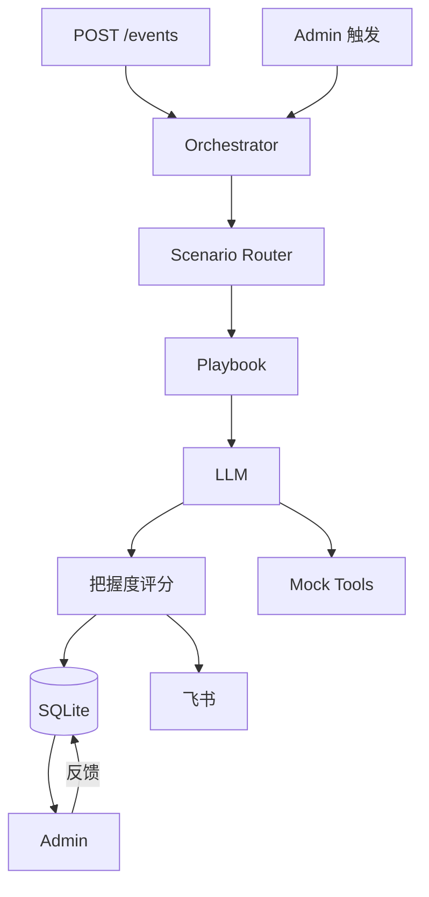

# CoAgent 设计规格说明 v3.1

**日期：** 2026-06-27  
**状态：** 已归档（见 [coagent-design-spec.md](../coagent-design-spec.md)）  
**版本：** v3.1 — Final 直接前身  
**主题：** ToB 场景 AI Agent — **Agent Ops Copilot**

> **⚠️ 已归档。** 已合并为 Final：[coagent-design-spec.md](../coagent-design-spec.md)

---

## 用户价值（一句话）

> **CoAgent 在 Agent 出错或烧钱时，几分钟内告诉你要不要动、怎么动、有多大把握，并把整个过程记下来让团队越用越准。**

---

## 0. 文档演进

| 版本 | 核心变化 |
|------|----------|
| v1 | 飞书双 Agent SRE 值班室 |
| v2 | Admin 主通道 + 把握度评分 + 三 infra 场景 |
| OPC 草案 | Agent Ops 叙事 + Webhook + Retry + 订阅 |
| **v3.1** | **Agent Ops 场景 + v2 工程深度 + 用户价值叙事** |

**Hackathon 只实施本文档，不再分线。**

---

## 1. 概述

### 1.1 问题

中小企业与 OPC 将客服、RAG、内容、自动化交给 **AI Agent**，但：

| # | 痛点 | 后果 |
|---|------|------|
| 1 | Agent **静默失败** | 客户先发现，而非系统 |
| 2 | 处置靠**翻日志** | 不知先重试、改 prompt 还是换模型 |
| 3 | **成本失控** | LLM 费用单日飙升无分级响应 |
| 4 | **无法复盘** | 说不清当时建议了什么、谁批准的 |

PagerDuty 管 infra，不管 Agent 运行态；通用 Chatbot 不管 **Ops 决策与置信度**。

### 1.2 方案

**CoAgent** = ToB **Agent Ops Copilot**

```
Webhook 事件 → Scenario Router → Playbook → LLM 推理 → 把握度评分
    → Admin（主）→ 飞书 IM（同步）→ 人工反馈 → 飞轮统计
```

| 能力 | 说明 |
|------|------|
| 接入 | `POST /events` 上报 run_fail / cost_report 等 |
| 推理 | LLM **真实**生成影响、假设、步骤、reasoning_chain |
| 评分 | 把握度评分三因子 → 🟢🟡🔴 分级 |
| 交互 | Admin 四 Tab 为主；飞书含 Retry |
| 迭代 | 👍/👎 反馈驱动 Ops 手册与 prompt 优化 |

### 1.3 Pitch 金句

> Agent 出错或烧钱时，90 秒内拿到「该信什么、该做什么、有多把握」——带把握度评分的 Agent Ops Copilot。

### 1.4 用户价值与 Pitch 叙事

#### 核心问题 → 价值

| 核心问题 | CoAgent 做什么 | 用户价值 |
|----------|-----------------|----------|
| Agent **挂了没人知道** | 事件接入 + 面板/IM 告警 | **少漏单** — 失败第一时间听见 |
| **挂了不知道怎么办** | LLM 修复建议 + 一键 Retry | **少瞎改、少翻日志** — 几分钟内有可执行下一步 |
| **不知道建议靠不靠谱** | 把握度评分 + 🟢🟡🔴 分级 | **敢动手** — 先看把握再执行 |
| **团队不敢执行、无法复盘** | Score 三因子分解 + 反馈飞轮 + 升级 @ | **控得住、查得着** — 敢拍板、事后可追溯 |

#### 价值递进（产品能力，非定价）

```
听见异常 → 获得处置建议 → 评估把握程度 → 团队复盘迭代
   │              │                │              │
 告警+面板      LLM+Retry        把握度评分    飞轮+@升级
```

**Hackathon Demo 主线：** 沿上述链路跑通 S1→S2→S3，Pitch 讲清「问题 → 价值」表，不展开商业定价。

### 1.5 价值创新：切口定位（创新性优先重排序）

> 参考：[idea.md](../../../idea.md) — 黑客松方向收敛与评分权重分析。

#### 1.5.1 为什么需要换叙事重心

Hackathon 评分表中 **场景创新性 30% + 技术深度 20% = 50%**，高于商业潜力（15%）与 Demo（10%）。  
若 CoAgent 只讲「Agent 挂了发通知 + LLM 写建议」，评委易归类为 **告警/Chatbot 换壳**（与 Azure SRE Agent、Datadog Bits、Rootly 等「关联+建议」路线同质）。

**改法不是换赛道，是换标题：** 同一套代码，叙事重心从「通知 + 建议」上移到 **「Agent Ops 可验证处置 + 可验证推理 + 可审计闭环」**。

| 叙事层级 | 评委感知 | 创新性 |
|----------|----------|--------|
| ❌ 弱 | 「又一个 Agent 监控/告警工具」 | 低 |
| ⚠️ 中 | 「LLM 帮写 runbook」 | 中 |
| ✅ **CoAgent 主线** | **「Agent 异常 → 根因推理 → 把握度评分可验证 → 人工把关处置 → 飞轮复盘」** | **高** |

#### 1.5.2 主线切口：Agent Ops 可验证处置 Copilot

**对外标题（Pitch 用）：**  
**「Agent 出问题时，不只告诉你挂了——顺根因链推一跳，给出带证据链和把握度的处置方案。」**

| 要素 | CoAgent 如何实现 | 对应 idea.md 洞察 |
|------|-------------------|------------------|
| **根因推理** | `reasoning_chain` + Playbook：如「429 限流 → 并发打满 → 客服不可用」；S2「空检索 → 幻觉答复 → 客诉」；S3「Token 突增 → 超预算 → 需降级」 | 前沿差异化在 **根因路径**，不在单纯 join |
| **可验证推理** | 把握度评分三因子（数据完备 / 手册匹配 / 推理一致性），非 LLM 自报 confidence | 攻 **Agent 幻觉真空** — 运维零幻觉容忍 |
| **人工把关** | 🟢 可执行 / 🟡 需确认 / 🔴 升级 @；Retry 需人触发或确认 | 企业「敢用」比「自主执行」优先 |
| **过程可审计** | Admin timeline + SQLite incident + 飞轮反馈 | 事故时间线自动沉淀，可复盘 |
| **私有化友好** | 本地部署 + Mock/自有 Webhook；核心数据不出域（Pitch 对齐主办方私有化算力栈） | 美国 SaaS RCA 进不来的 **金融/政企缝隙** |

**开场 30 秒三件套（必讲）：**

1. **跨信号 Agent Ops 推理** — 不是 log join，是 Playbook 约束下的根因链  
2. **每步可验证** — 把握度评分分解，评委可追问公式  
3. **处置可闭环** — 建议 + 把握度 + Retry/升级，全程留痕  

#### 1.5.3 三场景 = 创新性优先重排序（对齐 Demo）

idea.md 要求：**27h 只打磨一条路径，但 Demo 可用多场景展示「根因推理」的不同形态。** CoAgent 用 S1/S2/S3 展示同一创新内核的三种 Agent Ops 切面，**不是三条独立产品**。

| 优先级 | 场景 | 切口角色 | 根因推理（Demo 必讲清） | 创新性贡献 |
|--------|------|----------|------------------------|-----------|
| 🥇 **S1** | 客服 Agent API 限流 | **主线落地场景** | 变更/流量 → 429 → 服务不可用 → 重试可恢复 | 完整闭环 + 🟢 Score，现场主 Demo |
| 🥈 **S2** | RAG 空检索飙升 | **质量根因链** | 索引/知识库问题 → 空检索 → 错误回答级联 | 🟡「不能盲 retry，要改知识库」— 破「固定重试」 |
| 🥉 **S3** | Agent 日成本超预算 | **成本根因链** | 发布/流量 → Token 突增 → 超预算 → 需止血升级 | 🔴 升级分级 — 展示「敢不敢动」边界 |

> **范围警告：** 不为「丰富」而演示 infra 级 K8s 级联故障（idea.md 候选 1 完整版）——那是另一条 27h 做不完的线。CoAgent 的「根因推理」落在 **Agent 运行态层**，与当前 Spec 工程范围一致。

#### 1.5.4 与现成产品的差异（创新性答辩用）

| 现成路线 | 做什么 | CoAgent 差异 |
|----------|--------|--------------|
| Azure SRE Agent / Rootly / Harness | 变更 + 遥测 **关联**，根因+置信度 | 我们不做 infra 变更归因；做 **Agent Ops 层根因推理 + Score 可验证** |
| Datadog / 通用 APM | 告警 → 调查 → 「什么变了」 | 我们聚焦 **LLM Agent 失败/成本**，非通用 infra |
| 飞书/邮件 Webhook 通知器 | 挂了提醒 | 我们有 **推理链 + Score + 飞轮**，不是通知 |
| 通用 Chatbot Copilot | 自然语言问答 | 我们是 **事件驱动 Playbook + 结构化处置 + 审计** |

**CoAgent 占用的真空（idea.md 缝隙 2 + Agent 垂直）：**  
**「运维 AI 应用本身」+ 「零幻觉可解释处置」** — 与 LLMOps 哨兵方向同构，把握度评分是差异抓手。

#### 1.5.5 评分维度自评（创新叙事对齐）

| 维度 | 权重 | CoAgent 叙事抓手 |
|------|------|------------------|
| **场景创新** | **30%** | Agent Ops 根因推理 + 可验证 Score；非换壳告警 |
| 产品完成度 | 25% | Admin 四 Tab 闭环 + S1→S2→S3 + 飞书 |
| **技术深度** | **20%** | Router + Playbook + 三因子 Score + SSE 审计链 |
| 商业潜力 | 15% | 少漏单 / 少瞎改 / 少烧钱；ToB Agent 客户 |
| Demo 表现 | 10% | 现场切场景 + Score 变色 + 👎 飞轮 |

**Demo 加分项（idea.md）：** 预演基础上，Pitch 时 **口头改一个变量**（如 S2 换 symptom、S3 改 budget 阈值），展示非固定路径，补「技术深度」观感。

### 1.6 Hackathon 约束与评分

| 约束 | Solo · ~48h · SRE/云/IM 背景 |
|------|------------------------------|

| 维度 | 权重 | 拿分策略 |
|------|------|----------|
| 场景创新 | 30% | §1.5 根因推理 + 可验证 Score；非告警换壳 |
| 完成度 | 25% | Admin 闭环 + 3 场景 + Webhook + 飞书 |
| 技术深度 | 20% | Playbook 根因链 + 三因子 Score + 审计 timeline |
| 商业潜力 | 15% | 核心问题→价值清晰 + 少漏单/少烧钱 ROI |
| Demo | 10% | S1→S2→S3 切换 + 👎 飞轮 |

---

## 2. 范围

### 2.1 P0（48h 必交付）

- `POST /events` + Admin 触发 S1/S2/S3  
- Admin 四 Tab + SSE timeline  
- 3 Playbook + mock tools + 真 LLM  
- 把握度评分三因子 + grade 分级（Tab3 完整展示）  
- 飞书 S1 卡片 + Retry  
- 反馈 + 基础统计（飞轮 Tab4）  
- `demo.sh` · `calibrate_scores.sh` · Replay · 预录  

### 2.2 P1 / 不做

| P1 | 不做 |
|----|------|
| S2/S3 飞书 | 订阅 / 支付系统 |
| 飞书文档时间线 | Multi-Agent 编排平台 |
| | infra 告警（payment 5xx 等） |
| | LLM 推理静态伪造 |

---

## 3. Demo 场景（Agent Ops）

| ID | 场景 | type | agent | Ops | Score | grade |
|----|------|------|-------|-----|-------|-------|
| **S1** | 客服 Agent API 限流 | `run_fail` | cs-bot | OPS-101 | 82–88 | 🟢 |
| **S2** | RAG 空检索飙升 | `run_fail` | rag-bot | OPS-203 | 65–75 | 🟡 |
| **S3** | 日成本超预算 | `cost_report` | content-bot | OPS-305 | 50–58 | 🔴 |

**叙事：** 能重试 → 需确认改库 → 要止血升级。  
**根因推理（Pitch 必讲）：** 见 §1.5.3。

**Router：**

```python
ROUTES = {
    ("run_fail", "rate_limit"): "cs_rate_limit",
    ("run_fail", "empty_retrieval"): "rag_empty_retrieval",
    ("cost_report", "over_budget"): "cost_over_budget",
}
```

---

## 4. 架构



**技术栈：** Python 3.11 · FastAPI · SQLite · HTMX + SSE · 飞书 SDK · OpenAI 兼容 LLM

**项目结构：**

```
coagent/
├── app/
│   ├── main.py, orchestrator.py, router.py
│   ├── playbooks/          # cs_rate_limit, rag_empty_retrieval, cost_over_budget
│   ├── llm/, scoring/, tools/, channels/feishu_im.py
│   ├── models/, api/
├── web/                      # Admin HTMX
├── data/
│   ├── ops_playbooks.json, agents.json
│   ├── scenarios/            # s1.json, s2.json, s3.json
│   └── calibration/
├── scripts/demo.sh, calibrate_scores.sh
└── .env.example
```

---

## 5. 数据模型

### 5.1 事件 `POST /events`

```json
{
  "event_id": "evt-s1-001",
  "agent_id": "cs-bot",
  "agent_name": "客服 Agent",
  "type": "run_fail",
  "symptom": "rate_limit",
  "error": "OpenAI 429 rate limit",
  "log_snippet": "...",
  "cost_yuan_today": 8.5,
  "budget_yuan_daily": 20,
  "retry_webhook": "https://demo.coagent/retry/cs-bot",
  "ts": "2026-06-27T14:00:00+08:00"
}
```

S3：`type=cost_report`，`cost_yuan_today=28.5`，`budget_yuan_daily=20`。

### 5.2 LLM 输出（必须 LLM 生成）

```json
{
  "impact": "string",
  "hypothesis": ["string"],
  "reasoning_chain": ["string", "string", "string"],
  "steps": [{"order": 1, "action": "string", "command": "string|null", "risk": "low|medium|high"}],
  "comms_draft": "string",
  "retry_recommended": true
}
```

**约束：** 先完成 playbook `required_tools`；`reasoning_chain` ≥3 步；禁止 SOP 外的高风险操作。

### 5.3 把握度评分

```
total = round(100 × (0.35×D + 0.35×P + 0.30×C))
```

| 因子 | 计算 |
|------|------|
| **D** data_completeness | 必填字段 + log + tools 成功率 |
| **P** playbook_match | symptom/type vs Ops 标签 |
| **C** reasoning_consistency | hypothesis/steps vs error/log 规则 |

| total | grade | 动作 |
|-------|-------|------|
| ≥80 | executable 🟢 | 建议按步骤执行（人工确认高风险） |
| 60–79 | needs_confirmation 🟡 | 请负责人确认 |
| <60 | escalate 🔴 | @oncall / Admin 强调升级 |

**Admin Tab3 展示：** 总分 + grade + **三因子分解**（支撑「敢不敢执行」叙事）。

### 5.4 校准与 DEMO_MODE

1. `calibrate_scores.sh --scenario <id> --runs 10` → `data/calibration/<id>.json`  
2. 未命中 §3 Score 区间 → 调 mock / Ops 标签 / consistency 关键词  
3. `DEMO_MODE=true`：仅对 **C** 按 playbook `consistency_clamp` clamp；**不伪造 LLM 文本**  
4. LLM 完全失败 → Admin 错误态或 Replay，不读静态 hypothesis  

**Playbook 字段：**

```yaml
consistency_clamp: [0.68, 0.78]
expected_score: [82, 88]
expected_grade: executable
```

### 5.5 SQLite

```sql
CREATE TABLE incidents (
  id INTEGER PRIMARY KEY AUTOINCREMENT,
  trace_id TEXT NOT NULL UNIQUE,
  event_id TEXT NOT NULL,
  agent_id TEXT NOT NULL,
  scenario_id TEXT NOT NULL,
  status TEXT NOT NULL,
  event_json TEXT NOT NULL,
  llm_json TEXT,
  score_json TEXT,
  timeline_json TEXT,
  started_at TEXT NOT NULL,
  completed_at TEXT,
  feishu_msg_id TEXT,
  duration_ms INTEGER
);

CREATE TABLE feedback (
  id INTEGER PRIMARY KEY AUTOINCREMENT,
  incident_id INTEGER NOT NULL REFERENCES incidents(id),
  rating TEXT NOT NULL,
  comment TEXT,
  created_at TEXT NOT NULL
);

CREATE TABLE agent_daily_stats (
  agent_id TEXT NOT NULL,
  date TEXT NOT NULL,
  run_count INTEGER DEFAULT 0,
  fail_count INTEGER DEFAULT 0,
  cost_yuan REAL DEFAULT 0,
  PRIMARY KEY (agent_id, date)
);
```

---

## 6. Playbook 摘要

### S1 `cs_rate_limit`（OPS-101）

- Tools: `query_agent_metrics`, `query_agent_config`, `search_ops_playbook`  
- Mock: 429 计数 ↑，并发=10，OPS-101 限流手册  

### S2 `rag_empty_retrieval`（OPS-203）

- symptom: `empty_retrieval`  
- Mock: 空检索率 35%，索引版本 lag，OPS-203 知识库检查  

### S3 `cost_over_budget`（OPS-305）

- type: `cost_report`  
- Mock: 日成本 28.5/20，token 突增，OPS-305 停服/降级手册  

---

## 7. Admin 管理页

| Tab | 内容 |
|-----|------|
| **1** Agent/Incident | Agent 列表 + SSE timeline |
| **2** 场景触发 | S1/S2/S3 + 预期 Score |
| **3** Decision | 总分 + 三因子 + grade + 步骤 + Retry |
| **4** 飞轮 | 统计 + 👍/👎 |

**Tab1 线框：**

```
┌─────────────┬──────────────────────────┐
│ Agent 列表  │ SSE Timeline             │
│ cs-bot  85  │ tool → LLM → Score       │
│ rag-bot 68  │                          │
└─────────────┴──────────────────────────┘
```

### 7.1 API

| 方法 | 路径 | 说明 |
|------|------|------|
| POST | `/events` | Webhook |
| POST | `/admin/trigger/{scenario_id}` | Demo 触发 |
| GET | `/admin/incidents` | 列表 |
| GET | `/admin/incidents/{trace_id}` | 详情 |
| GET | `/admin/incidents/{trace_id}/stream` | SSE |
| POST | `/admin/incidents/{trace_id}/feedback` | 反馈 |
| GET | `/admin/stats` | 飞轮统计 |
| POST | `/admin/replay/{trace_id}` | Replay |

成功响应：`{ "status": "ok", "trace_id": "..." }`  
重复 event_id（10min）：`{ "status": "duplicate", "trace_id": "..." }`

---

## 8. SSE 协议

```
event: incident
data: {"type":"score_computed","trace_id":"...","ts":"...","payload":{...}}
```

| type | 说明 |
|------|------|
| incident_started | 事件进入 |
| tool_called | tool 完成 |
| llm_reasoning | reasoning_chain |
| llm_result | 完整 LLM JSON |
| score_computed | Score + grade |
| channel_sync | 飞书状态 |
| incident_completed | 成功结束 |
| incident_failed | L0 失败 |

---

## 9. 飞书（S1 P0）

```
🔴 Agent 异常 | cs-bot | Score 85 🟢
错误：OpenAI 429 rate limit
今日：¥8.5 / ¥20
1. [低] 等待 60s 重试
2. [中] 切换 backup key
[一键重试] [Admin]
```

S3 🔴 → `@FEISHU_ESCALATE_USER_ID`

---

## 10. 错误处理

| 层级 | 触发 | Admin | 禁止 |
|------|------|-------|------|
| **L0** | LLM 失败 | 错误态 + 重试/Replay | 伪造 hypothesis |
| **L1** | Tool 失败 | 降级 mock；D↓ | 中断 pipeline |
| **L2** | 飞书失败 | Admin 完整；demo.log | — |
| **L3** | 现场灾难 | Replay + 预录 | — |

**Demo 铁律：** Admin 永不空白；推理不可假，通道可兜底。

---

## 11. Demo 脚本（5 分钟）

| 时间 | 动作 |
|------|------|
| 0:00 | 痛点 + 用户价值一句话 |
| 0:30 | Tab2 → **S1** → Tab1 timeline |
| 1:15 | Tab3 🟢 + Retry（敢动手） |
| 1:40 | Tab2 → **S2** → Tab3 🟡（需确认） |
| 2:05 | Tab2 → **S3** → Tab3 🔴（升级止血） |
| 2:40 | Tab4 👎 → 飞轮统计更新 |
| 3:10 | 飞书 S1 |
| 4:00 | §1.5 三件套 + 核心问题→价值 + 「越用越准」 |
| 5:00 | Q&A |

**兜底：** `demo.sh` · calibrate ×10 · Replay · 预录 30s

---

## 12. 48h 时间线

| 阶段 | h | 交付 |
|------|---|------|
| 骨架 | 0–5 | FastAPI + SQLite + `/events` + Admin 壳 |
| S1 | 5–14 | Playbook + LLM + tools |
| Score | 14–18 | 三因子 + grade |
| Admin | 18–26 | 4 Tab + SSE |
| S2/S3 | 26–32 | 两 playbook + demo JSON |
| 飞书 | 32–36 | S1 + Retry |
| 飞轮 | 36–40 | 反馈 + stats + **calibrate 三场景** |
| 兜底 | 40–44 | Replay + 预录 |
| Pitch | 44–48 | 5 页 deck ×3 排练 |

---

## 13. 配置

```env
LLM_API_KEY=
LLM_BASE_URL=
LLM_MODEL=gpt-4o-mini
FEISHU_APP_ID=
FEISHU_APP_SECRET=
FEISHU_CHAT_ID=
FEISHU_ESCALATE_USER_ID=
DEMO_MODE=true
```

---

## 14. Pitch Deck（5 页）

| 页 | 内容 |
|----|------|
| 1 | 问题：Agent 静默失败、乱烧钱、无法复盘 |
| 2 | 用户价值 + **切口定位三件套**（§1.4–§1.5） |
| 3 | Live Demo：S1→S2→S3 根因链 + 飞轮 |
| 4 | 技术：Playbook 根因推理 + 把握度评分可验证 |
| 5 | 价值闭环 + 与 Azure/Datadog 差异（§1.5.4） |

---

## 15. 验收标准

- [ ] S1/S2/S3 Webhook 与 Admin 触发均可闭环  
- [ ] Tab1 Agent 列表 + SSE timeline  
- [ ] LLM 真实 reasoning_chain / steps  
- [ ] S1/S2/S3 Score 与 grade 符合 §3（或 clamp）  
- [ ] Tab3 展示 Score 总分 + 三因子 + grade  
- [ ] S1 飞书 + Retry；S3 升级态可展示  
- [ ] Tab4 反馈更新统计  
- [ ] L0 不伪造；Replay 可用  
- [ ] calibrate + demo.sh 各 10 次稳定  

---

## 16. 赛后路线图

- 真实用户 webhook 接入 · Ops 手册 RAG · 自动 retry · 飞书文档时间线  
- 第四条 infra 场景（可选，不替代 Agent Ops 主线）  
- 商业化与定价（单独文档，不在本 spec）

---

## 17. 文档索引

| 文档 | 状态 |
|------|------|
| [idea.md](../../../idea.md) | 方向收敛 / 切口定位参考 |
| v1 / v2 / OPC 草案 | 历史 / 已合并 |
| **coagent-design-spec.md** | **唯一实施基线（Final）** |
