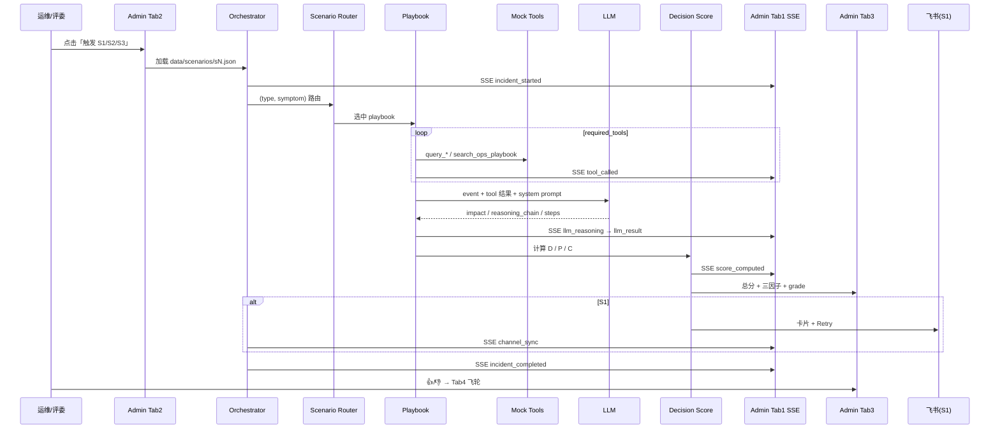
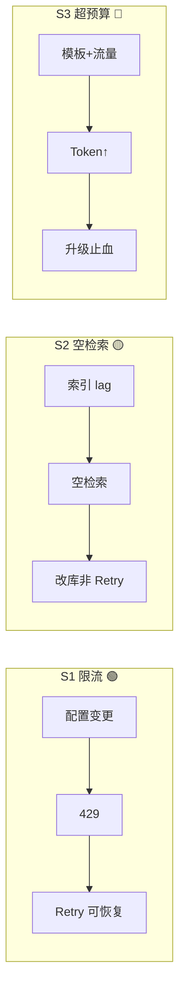
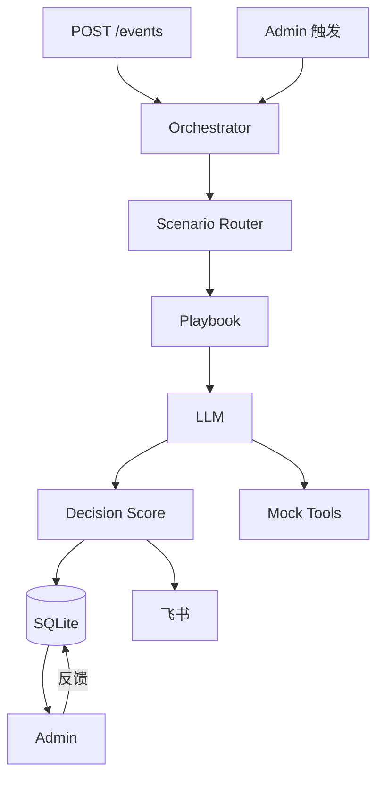

# CoAgent 设计规格说明

**日期：** 2026-06-27  
**状态：** 最终定稿  
**版本：** Final  
**主题：** ToB 场景 AI Agent — **Agent Ops Copilot**

> **Hackathon 唯一实施基线。** 历史草案见 [archive/](./archive/README.md)。

---

## 用户价值（一句话）

> **CoAgent 在 Agent 出错或烧钱时，几分钟内告诉你要不要动、怎么动、有多大把握，并把整个过程记下来让团队越用越准。**

---

## 0. 文档演进

| 阶段 | 核心变化 | 归档 |
|------|----------|------|
| v1 | 飞书双 Agent SRE 值班室 | [archive/2026-06-27-coagent-design.md](./archive/2026-06-27-coagent-design.md) |
| v2 | Admin 主通道 + Decision Score + 三 infra 场景 | [archive/2026-06-27-coagent-design-v2.md](./archive/2026-06-27-coagent-design-v2.md) |
| OPC 草案 | Agent Ops 叙事 + Webhook + Retry | [archive/2026-06-27-opc-agent-ops-design.md](./archive/2026-06-27-opc-agent-ops-design.md) |
| v3.1 | Agent Ops 场景 + 工程深度 + 价值创新叙事 | [archive/2026-06-27-coagent-design-v3.md](./archive/2026-06-27-coagent-design-v3.md) |
| **Final** | **本文档 — 合并定稿，作为唯一实施基线** | — |

**Hackathon 只实施本文档，不再分线。**

---

## 1. 概述

### 1.1 问题

中小企业与 OPC 将客服、RAG、内容、自动化交给 **AI Agent**，但：

| # | 痛点 | 后果 |
|---|------|------|
| 1 | Agent **静默失败** | 客户先发现，而非系统 |
| 2 | 处置靠**翻日志** | 不知先重试、改 prompt 还是换模型 |
| 3 | **成本失控** | LLM 费用单日飙升无分级响应 |
| 4 | **无法复盘** | 说不清当时建议了什么、谁批准的 |

PagerDuty 管 infra，不管 Agent 运行态；通用 Chatbot 不管 **Ops 决策与置信度**。

### 1.2 方案

**CoAgent** = ToB **Agent Ops Copilot**

```
Webhook 事件 → Scenario Router → Playbook → LLM 推理 → Decision Score
    → Admin（主）→ 飞书 IM（同步）→ 人工反馈 → 飞轮统计
```

| 能力 | 说明 |
|------|------|
| 接入 | `POST /events` 上报 run_fail / cost_report 等 |
| 推理 | LLM **真实**生成影响、假设、步骤、reasoning_chain |
| 评分 | Decision Score 三因子 → 🟢🟡🔴 分级 |
| 交互 | Admin 四 Tab 为主；飞书含 Retry |
| 迭代 | 👍/👎 反馈驱动 Ops 手册与 prompt 优化 |

### 1.3 Pitch 金句

> Agent 出错或烧钱时，90 秒内拿到「该信什么、该做什么、有多把握」——带 Decision Score 的 Agent Ops Copilot。

### 1.4 用户价值与 Pitch 叙事

#### 核心问题 → 价值

| 核心问题 | CoAgent 做什么 | 用户价值 |
|----------|-----------------|----------|
| Agent **挂了没人知道** | 事件接入 + 面板/IM 告警 | **少漏单** — 失败第一时间听见 |
| **挂了不知道怎么办** | LLM 修复建议 + 一键 Retry | **少瞎改、少翻日志** — 几分钟内有可执行下一步 |
| **不知道建议靠不靠谱** | Decision Score + 🟢🟡🔴 分级 | **敢动手** — 先看把握再执行 |
| **团队不敢执行、无法复盘** | Score 三因子分解 + 反馈飞轮 + 升级 @ | **控得住、查得着** — 敢拍板、事后可追溯 |

#### 价值递进（产品能力，非定价）

```
听见异常 → 获得处置建议 → 评估把握程度 → 团队复盘迭代
   │              │                │              │
 告警+面板      LLM+Retry        Decision Score    飞轮+@升级
```

**Hackathon Demo 主线：** 沿上述链路跑通 S1→S2→S3，Pitch 讲清「问题 → 价值」表，不展开商业定价。

### 1.5 价值创新：切口定位（创新性优先重排序）

> 参考：[idea.md](../../../idea.md) — 黑客松方向收敛与评分权重分析。

#### 1.5.1 为什么需要换叙事重心

Hackathon 评分表中 **场景创新性 30% + 技术深度 20% = 50%**，高于商业潜力（15%）与 Demo（10%）。  
若 CoAgent 只讲「Agent 挂了发通知 + LLM 写建议」，评委易归类为 **告警/Chatbot 换壳**（与 Azure SRE Agent、Datadog Bits、Rootly 等「关联+建议」路线同质）。

**改法不是换赛道，是换标题：** 同一套代码，叙事重心从「通知 + 建议」上移到 **「Agent Ops 因果处置 + 可验证推理 + 可审计闭环」**。

| 叙事层级 | 评委感知 | 创新性 |
|----------|----------|--------|
| ❌ 弱 | 「又一个 Agent 监控/告警工具」 | 低 |
| ⚠️ 中 | 「LLM 帮写 runbook」 | 中 |
| ✅ **CoAgent 主线** | **「Agent 异常 → 因果一跳 → Decision Score 可验证 → Human-in-loop 处置 → 飞轮复盘」** | **高** |

#### 1.5.2 主线切口：Agent Ops 可验证因果处置 Copilot

**对外标题（Pitch 用）：**  
**「Agent 出问题时，不只告诉你挂了——顺因果链推一跳，给出带证据链和把握度的处置方案。」**

| 要素 | CoAgent 如何实现 | 对应 idea.md 洞察 |
|------|-------------------|------------------|
| **因果一跳** | `reasoning_chain` + Playbook：如「429 限流 → 并发打满 → 客服不可用」；S2「空检索 → 幻觉答复 → 客诉」；S3「Token 突增 → 超预算 → 需降级」 | 前沿差异化在 **因果+拓扑**，不在单纯 join |
| **可验证推理** | Decision Score 三因子（数据完备 / 手册匹配 / 推理一致性），非 LLM 自报 confidence | 攻 **Agent 幻觉真空** — 运维零幻觉容忍 |
| **Human-in-loop** | 🟢 可执行 / 🟡 需确认 / 🔴 升级 @；Retry 需人触发或确认 | 企业「敢用」比「自主执行」优先 |
| **过程可审计** | Admin timeline + SQLite incident + 飞轮反馈 | 事故时间线自动沉淀，可复盘 |
| **私有化友好** | 本地部署 + Mock/自有 Webhook；核心数据不出域（Pitch 对齐主办方私有化算力栈） | 美国 SaaS RCA 进不来的 **金融/政企缝隙** |

**开场 30 秒三件套（必讲）：**

1. **跨信号 Agent Ops 推理** — 不是 log join，是 Playbook 约束下的因果链  
2. **每步可验证** — Decision Score 分解，评委可追问公式  
3. **处置可闭环** — 建议 + 把握度 + Retry/升级，全程留痕  

#### 1.5.3 三场景 = 创新性优先重排序（对齐 Demo）

**CoAgent 用 S1/S2/S3 展示同一创新内核的三种 Agent Ops 切面，**不是三条独立产品**。

| 优先级 | 场景 | 切口角色 | 因果一跳（Demo 必讲清） | 创新性贡献 |
|--------|------|----------|------------------------|-----------|
| 🥇 **S1** | 客服 Agent API 限流 | **主线落地场景** | 变更/流量 → 429 → 服务不可用 → 重试可恢复 | 完整闭环 + 🟢 Score，现场主 Demo |
| 🥈 **S2** | RAG 空检索飙升 | **质量因果链** | 索引/知识库问题 → 空检索 → 错误回答级联 | 🟡「不能盲 retry，要改知识库」— 破「固定重试」 |
| 🥉 **S3** | Agent 日成本超预算 | **成本因果链** | 发布/流量 → Token 突增 → 超预算 → 需止血升级 | 🔴 升级分级 — 展示「敢不敢动」边界 |

> **范围警告：** CoAgent 的「因果」落在 **Agent 运行态层**，与当前 Spec 工程范围一致。

#### 1.5.4 与现成产品的差异（创新性答辩用）

| 现成路线 | 做什么 | CoAgent 差异 |
|----------|--------|--------------|
| Azure SRE Agent / Rootly / Harness | 变更 + 遥测 **关联**，根因+置信度 | 我们不做 infra 变更归因；做 **Agent Ops 层因果 + Score 可验证** |
| Datadog / 通用 APM | 告警 → 调查 → 「什么变了」 | 我们聚焦 **LLM Agent 失败/成本**，非通用 infra |
| 飞书/邮件 Webhook 通知器 | 挂了提醒 | 我们有 **推理链 + Score + 飞轮**，不是通知 |
| 通用 Chatbot Copilot | 自然语言问答 | 我们是 **事件驱动 Playbook + 结构化处置 + 审计** |

**CoAgent 占用的真空：**  
**「运维 AI 应用本身」+ 「零幻觉可解释处置」** — 与 LLMOps 哨兵方向同构，Decision Score 是差异抓手。

#### 1.5.5 评分维度自评（创新叙事对齐）

| 维度 | 权重 | CoAgent 叙事抓手 |
|------|------|------------------|
| **场景创新** | **30%** | Agent Ops 因果一跳 + 可验证 Score；非换壳告警 |
| 产品完成度 | 25% | Admin 四 Tab 闭环 + S1→S2→S3 + 飞书 |
| **技术深度** | **20%** | Router + Playbook + 三因子 Score + SSE 审计链 |
| 商业潜力 | 15% | 少漏单 / 少瞎改 / 少烧钱；ToB Agent 客户 |
| Demo 表现 | 10% | 现场切场景 + Score 变色 + 👎 飞轮 |

**Demo 加分项（idea.md）：** 预演基础上，Pitch 时 **口头改一个变量**（如 S2 换 symptom、S3 改 budget 阈值），展示非固定路径，补「技术深度」观感。

### 1.6 Hackathon 约束与评分

| 约束 | Solo · ~48h · SRE/云/IM 背景 |
|------|------------------------------|
| 场景创新 | 30% — §1.5 因果一跳 + 可验证 Score |
| 完成度 | 25% — Admin 闭环 + 3 场景 + Webhook + 飞书 |
| 技术深度 | 20% — Playbook 因果链 + 三因子 Score + 审计 timeline |
| 商业潜力 | 15% — 核心问题→价值清晰 + 少漏单/少烧钱 ROI |
| Demo | 10% — S1→S2→S3 切换 + 👎 飞轮 |

---

## 2. 范围

### 2.1 P0（48h 必交付）

- `POST /events` + Admin 触发 S1/S2/S3  
- Admin 四 Tab + SSE timeline  
- 3 Playbook + mock tools + 真 LLM  
- Decision Score 三因子 + grade 分级（Tab3 完整展示）  
- 飞书 S1 卡片 + Retry  
- 反馈 + 基础统计（飞轮 Tab4）  
- `demo.sh` · `calibrate_scores.sh` · Replay · 预录  

### 2.2 P1 / 不做

| P1 | 不做 |
|----|------|
| S2/S3 飞书 | 订阅 / 支付系统 |
| 飞书文档时间线 | Multi-Agent 编排平台 |
| | infra 告警（payment 5xx 等） |
| | LLM 推理静态伪造 |

---

## 3. Demo 场景（Agent Ops）

### 3.1 三场景总览

| | S1 限流 | S2 空检索 | S3 超预算 |
|---|---------|-----------|-----------|
| **Agent** | cs-bot 客服 | rag-bot 知识问答 | content-bot 内容生成 |
| **事件** | `run_fail` + `rate_limit` | `run_fail` + `empty_retrieval` | `cost_report` + `over_budget` |
| **用户痛点** | 挂了不知道能不能重试 | 错了不能盲 retry | 烧钱不知道谁拍板 |
| **因果一跳** | 流量↑ → 429 → 客服不可用 | 索引 lag → 空检索 → 答非所问 | 发布↑ → Token↑ → 超预算 |
| **Ops** | OPS-101 | OPS-203 | OPS-305 |
| **Score** | 82–88 🟢 | 65–75 🟡 | 50–58 🔴 |
| **处置边界** | 可执行（人点 Retry） | 需确认（改知识库） | 升级 @（止血） |
| **飞书** | P0 卡片 + Retry | Admin 为主 | Admin 升级态 |

**叙事递进：** 敢动手 → 不敢盲动 → 必须升级。  
**因果一跳（Pitch 必讲）：** 见 §1.5.3。

**Router：**

```python
ROUTES = {
    ("run_fail", "rate_limit"): "cs_rate_limit",
    ("run_fail", "empty_retrieval"): "rag_empty_retrieval",
    ("cost_report", "over_budget"): "cost_over_budget",
}
```

### 3.2 统一流程（三场景共用）



**典型耗时：** 8–15s（Pitch 可说「90 秒内拿到结论」，含人工切换 Tab）。

**SSE 事件顺序（Tab1 逐条滚动）：**

```
incident_started → tool_called ×3 → llm_reasoning → llm_result
→ score_computed → [channel_sync] → incident_completed
```

### 3.3 S1 — 客服 Agent API 限流（主 Demo · 🟢）

**场景故事：** 电商 OPC 的 cs-bot 接 OpenAI。大促前并发 5→10，触发连续 429，客服 thread 全挂。运维不知该等、重试还是换 key。

**触发数据** `data/scenarios/s1.json`：

```json
{
  "event_id": "evt-s1-demo",
  "agent_id": "cs-bot",
  "agent_name": "客服 Agent",
  "type": "run_fail",
  "symptom": "rate_limit",
  "error": "OpenAI 429: Rate limit exceeded for gpt-4o-mini",
  "log_snippet": "[14:02:11] retry=3/3 failed; model=gpt-4o-mini; concurrent=10",
  "cost_yuan_today": 8.5,
  "budget_yuan_daily": 20,
  "retry_webhook": "http://localhost:8000/demo/retry/cs-bot",
  "ts": "2026-06-27T14:02:00+08:00"
}
```

**Playbook：** `cs_rate_limit` · OPS-101

| Tool | Mock 返回要点 |
|------|---------------|
| `query_agent_metrics` | 429 次数 47/5min，失败率 38% |
| `query_agent_config` | `concurrent=10`，`rpm_limit=60`，昨日 concurrent=5 |
| `search_ops_playbook` | OPS-101：等待 / 降并发 / 换 key |

**LLM 期望形态（真实生成，非静态）：**

```json
{
  "impact": "客服 Agent 近 5 分钟 38% 请求失败，用户咨询无法自动回复",
  "hypothesis": ["并发 5→10 触发 OpenAI RPM 限流", "当前 key 配额已打满"],
  "reasoning_chain": [
    "配置变更：concurrent 5→10，请求速率超过 rpm_limit",
    "API 层：OpenAI 返回 429 rate limit",
    "业务层：cs-bot 连续重试失败，客服通道不可用"
  ],
  "steps": [
    {"order": 1, "action": "等待 60s 后手动重试", "command": null, "risk": "low"},
    {"order": 2, "action": "临时将 concurrent 降回 5", "command": "coagent config set cs-bot concurrent=5", "risk": "medium"},
    {"order": 3, "action": "切换 backup API key", "command": "coagent secret rotate cs-bot --key backup", "risk": "medium"}
  ],
  "comms_draft": "【客服 Agent 异常】429 限流，已建议降并发并重试",
  "retry_recommended": true
}
```

**Score 设计（目标 85 🟢）：**

| 因子 | 目标 | 手段 |
|------|------|------|
| D | 0.92 | 字段齐全 + 3/3 tools + log 含 `429` |
| P | 0.88 | symptom=`rate_limit` 命中 OPS-101 |
| C | clamp 0.75 | hypothesis 含 `429`/`concurrent`；steps 引用 OPS-101 |

```yaml
# playbook cs_rate_limit
consistency_clamp: [0.72, 0.78]
expected_score: [82, 88]
expected_grade: executable
```

**实现效果：**

- **Tab1 SSE：** tool×3 → reasoning_chain → score_computed(85 🟢) → channel_sync → completed（~13s）
- **Tab3：** 总分 + 三因子 + 步骤 + **[一键 Retry]**
- **飞书：** 卡片含 Score、步骤、Retry 按钮（§9）
- **Pitch：** 「限流是 Agent 配置打满配额——Score 85，可以先 Retry。」

### 3.4 S2 — RAG 空检索飙升（质量链 · 🟡）

**场景故事：** rag-bot 接企业知识库。FAQ 更新后未 rebuild 索引 → 空检索率 5%→35%。Agent 仍「自信作答」，客诉上升。盲 Retry 只会重复幻觉。

**触发数据** `data/scenarios/s2.json`：

```json
{
  "event_id": "evt-s2-demo",
  "agent_id": "rag-bot",
  "agent_name": "RAG 客服 Agent",
  "type": "run_fail",
  "symptom": "empty_retrieval",
  "error": "Retrieval returned 0 chunks above threshold 0.7",
  "log_snippet": "[09:15:22] empty_retrieval_rate=35%; index_version=v2.3; kb_last_sync=2026-06-26",
  "cost_yuan_today": 12.0,
  "budget_yuan_daily": 30,
  "retry_webhook": null,
  "ts": "2026-06-27T09:15:00+08:00"
}
```

**Playbook：** `rag_empty_retrieval` · OPS-203

| Tool | Mock 返回要点 |
|------|---------------|
| `query_agent_metrics` | 空检索率 35%（基线 5%），幻觉投诉 +12 |
| `query_agent_config` | `index_version=v2.3`，`kb_last_sync` 滞后 1 天 |
| `search_ops_playbook` | OPS-203：rebuild 索引 / 兜底 prompt |

**LLM 期望形态：**

```json
{
  "impact": "35% 问答无知识库支撑，易产生错误答复",
  "hypothesis": ["知识库更新后索引未 rebuild", "检索阈值过高"],
  "reasoning_chain": [
    "知识库：kb_last_sync 滞后，index 与文档不一致",
    "检索层：empty_retrieval_rate 35%",
    "回答层：模型仍生成完整答案 → 客诉级联"
  ],
  "steps": [
    {"order": 1, "action": "切换「无法确认」兜底 prompt", "command": "coagent prompt set rag-bot fallback=strict", "risk": "medium"},
    {"order": 2, "action": "触发向量索引 rebuild", "command": "coagent kb rebuild rag-bot --version v2.4", "risk": "medium"},
    {"order": 3, "action": "rebuild 后抽样 20 条验证", "command": null, "risk": "low"}
  ],
  "comms_draft": "【RAG 质量告警】空检索飙升，建议 rebuild 索引",
  "retry_recommended": false
}
```

**Score 设计（目标 70 🟡）：**

| 因子 | 目标 | 手段 |
|------|------|------|
| D | 0.85 | log 含 `empty_retrieval`；无 retry_webhook 略降 |
| P | 0.80 | symptom 命中 OPS-203 |
| C | clamp 0.68 | steps 含 rebuild/索引关键词 |

```yaml
consistency_clamp: [0.65, 0.72]
expected_score: [65, 75]
expected_grade: needs_confirmation
```

**实现效果：**

- **Tab3：** 🟡 70 + **⚠️ 不建议 Retry** + [确认后执行]（无 Retry 按钮）
- **Tab1 左侧：** `rag-bot  70 🟡`
- **Pitch：** 「同样 run_fail，S1 能 Retry，S2 不能——Score 定义敢不敢动的边界。」
- **现场改变量：** 口头改 `empty_retrieval_rate` 为 15%，展示 Score 非固定路径

### 3.5 S3 — Agent 日成本超预算（成本链 · 🔴）

**场景故事：** content-bot 上新模板 + 批量任务 → 日成本 **¥28.5 / 预算 ¥20**。非报错，是 `cost_report`。一线无权停服，须升级负责人止血。

**触发数据** `data/scenarios/s3.json`：

```json
{
  "event_id": "evt-s3-demo",
  "agent_id": "content-bot",
  "agent_name": "内容生成 Agent",
  "type": "cost_report",
  "symptom": "over_budget",
  "error": null,
  "log_snippet": "[18:00:00] tokens_today=1.2M (+180% vs 7d avg); top_route=marketing-batch",
  "cost_yuan_today": 28.5,
  "budget_yuan_daily": 20,
  "retry_webhook": null,
  "ts": "2026-06-27T18:00:00+08:00"
}
```

**Playbook：** `cost_over_budget` · OPS-305

| Tool | Mock 返回要点 |
|------|---------------|
| `query_agent_metrics` | Token 1.2M/日（+180%），top route `marketing-batch` |
| `query_agent_config` | 新模板 `v3-longform` 昨日发布，`max_tokens=4096` |
| `search_ops_playbook` | OPS-305：限流 / 降级模型 / 暂停 batch / 升级审批 |

**LLM 期望形态：**

```json
{
  "impact": "日成本超预算 42.5%，若不干预今日预计 ¥35+",
  "hypothesis": ["marketing-batch 调用量突增", "新模板单请求 token 翻倍"],
  "reasoning_chain": [
    "发布：v3-longform 上线，max_tokens 4096",
    "流量：marketing-batch 占 token 62%",
    "成本：¥28.5 > 预算 ¥20 → 需负责人止血"
  ],
  "steps": [
    {"order": 1, "action": "暂停 marketing-batch 非紧急任务", "command": "coagent route pause content-bot marketing-batch", "risk": "high"},
    {"order": 2, "action": "临时降级模型并 cap max_tokens", "command": "coagent model downgrade content-bot", "risk": "high"},
    {"order": 3, "action": "通知业务负责人确认是否继续投放", "command": null, "risk": "low"}
  ],
  "comms_draft": "【成本告警】超预算 42%，建议暂停 batch，需 @负责人 确认",
  "retry_recommended": false
}
```

**Score 设计（目标 54 🔴）：**

| 因子 | 目标 | 手段 |
|------|------|------|
| D | 0.78 | cost 字段齐全；`error` 为空（cost 事件正常） |
| P | 0.72 | type=`cost_report` + OPS-305 |
| C | clamp 0.50 | 含 high risk steps；需人工审批 |

```yaml
consistency_clamp: [0.48, 0.55]
expected_score: [50, 58]
expected_grade: escalate
```

**实现效果：**

- **Tab3：** 🔴 54 + **@FEISHU_ESCALATE_USER_ID** + 高风险步骤不可自动执行
- **无飞书 P0**（P1）；Admin 展示升级文案与 `comms_draft`
- **Pitch：** 「不是坏了，是烧钱——Score 54 告诉你不该自己动，该升级。」

### 3.6 Admin Tab3 差异化渲染

| grade | Tab3 主色 | Retry | 升级 @ |
|-------|-----------|-------|--------|
| 🟢 executable | green | 显示 | 否 |
| 🟡 needs_confirmation | amber | 隐藏 | 否 |
| 🔴 escalate | red | 隐藏 | 显示 |

### 3.7 场景对比（答辩用）



| 维度 | S1 | S2 | S3 |
|------|----|----|-----|
| 事件类型 | 失败 | 失败 | 成本 |
| 核心问题 | 能不能恢复 | 能不能信 | 谁有权动 |
| C 因子 | 高 | 中 | 低 |
| 飞书 | ✅ | — | — |
| 飞轮 Demo | 👍 可选 | 👎 推荐 | — |

**实现文件：**

```
data/agents.json
data/ops_playbooks.json       # OPS-101 / 203 / 305
data/scenarios/s1.json | s2.json | s3.json
data/calibration/             # calibrate_scores.sh 产出
app/playbooks/cs_rate_limit.py | rag_empty_retrieval.py | cost_over_budget.py
```

每个 Playbook 须实现：`required_tools`（D）、`ops_tags`（P）、`consistency_rules`（C）、`consistency_clamp` / `expected_score`。

---

## 4. 架构



**技术栈：** Python 3.11 · FastAPI · SQLite · HTMX + SSE · 飞书 SDK · OpenAI 兼容 LLM

**项目结构：**

```
coagent/
├── app/
│   ├── main.py, orchestrator.py, router.py
│   ├── playbooks/          # cs_rate_limit, rag_empty_retrieval, cost_over_budget
│   ├── llm/, scoring/, tools/, channels/feishu_im.py
│   ├── models/, api/
├── web/                      # Admin HTMX
├── data/
│   ├── ops_playbooks.json, agents.json
│   ├── scenarios/            # s1.json, s2.json, s3.json
│   └── calibration/
├── scripts/demo.sh, calibrate_scores.sh
└── .env.example
```

---

## 5. 数据模型

### 5.1 事件 `POST /events`

完整 Demo payload 见 **§3.3–§3.5**（`data/scenarios/s1.json` 等）。通用字段：

```json
{
  "event_id": "evt-s1-001",
  "agent_id": "cs-bot",
  "agent_name": "客服 Agent",
  "type": "run_fail",
  "symptom": "rate_limit",
  "error": "OpenAI 429 rate limit",
  "log_snippet": "...",
  "cost_yuan_today": 8.5,
  "budget_yuan_daily": 20,
  "retry_webhook": "https://demo.coagent/retry/cs-bot",
  "ts": "2026-06-27T14:00:00+08:00"
}
```

S3 差异：`type=cost_report`，`symptom=over_budget`，`error=null`，`cost_yuan_today=28.5`。

### 5.2 LLM 输出（必须 LLM 生成）

```json
{
  "impact": "string",
  "hypothesis": ["string"],
  "reasoning_chain": ["string", "string", "string"],
  "steps": [{"order": 1, "action": "string", "command": "string|null", "risk": "low|medium|high"}],
  "comms_draft": "string",
  "retry_recommended": true
}
```

**约束：** 先完成 playbook `required_tools`；`reasoning_chain` ≥3 步；禁止 SOP 外的高风险操作。

### 5.3 Decision Score

```
total = round(100 × (0.35×D + 0.35×P + 0.30×C))
```

| 因子 | 计算 |
|------|------|
| **D** data_completeness | 必填字段 + log + tools 成功率 |
| **P** playbook_match | symptom/type vs Ops 标签 |
| **C** reasoning_consistency | hypothesis/steps vs error/log 规则 |

| total | grade | 动作 |
|-------|-------|------|
| ≥80 | executable 🟢 | 建议按步骤执行（人工确认高风险） |
| 60–79 | needs_confirmation 🟡 | 请负责人确认 |
| <60 | escalate 🔴 | @oncall / Admin 强调升级 |

**Admin Tab3 展示：** 总分 + grade + **三因子分解**（支撑「敢不敢执行」叙事）。

### 5.4 校准与 DEMO_MODE

1. `calibrate_scores.sh --scenario <id> --runs 10` → `data/calibration/<id>.json`  
2. 未命中 §3 Score 区间 → 调 mock / Ops 标签 / consistency 关键词  
3. `DEMO_MODE=true`：仅对 **C** 按 playbook `consistency_clamp` clamp；**不伪造 LLM 文本**  
4. LLM 完全失败 → Admin 错误态或 Replay，不读静态 hypothesis  

**Playbook 字段（各场景取值见 §3.3–§3.5）：**

```yaml
consistency_clamp: [0.68, 0.78]
expected_score: [82, 88]
expected_grade: executable
```

### 5.5 SQLite

```sql
CREATE TABLE incidents (
  id INTEGER PRIMARY KEY AUTOINCREMENT,
  trace_id TEXT NOT NULL UNIQUE,
  event_id TEXT NOT NULL,
  agent_id TEXT NOT NULL,
  scenario_id TEXT NOT NULL,
  status TEXT NOT NULL,
  event_json TEXT NOT NULL,
  llm_json TEXT,
  score_json TEXT,
  timeline_json TEXT,
  started_at TEXT NOT NULL,
  completed_at TEXT,
  feishu_msg_id TEXT,
  duration_ms INTEGER
);

CREATE TABLE feedback (
  id INTEGER PRIMARY KEY AUTOINCREMENT,
  incident_id INTEGER NOT NULL REFERENCES incidents(id),
  rating TEXT NOT NULL,
  comment TEXT,
  created_at TEXT NOT NULL
);

CREATE TABLE agent_daily_stats (
  agent_id TEXT NOT NULL,
  date TEXT NOT NULL,
  run_count INTEGER DEFAULT 0,
  fail_count INTEGER DEFAULT 0,
  cost_yuan REAL DEFAULT 0,
  PRIMARY KEY (agent_id, date)
);
```

---

## 6. Playbook 摘要

各 Playbook 的 Mock 数据、Score 校准与 UI 效果见 **§3.3–§3.5**。共用约束：

- **Tools（三场景相同）：** `query_agent_metrics`, `query_agent_config`, `search_ops_playbook`
- **LLM 约束：** 先完成 `required_tools`；`reasoning_chain` ≥3 步；禁止 Ops 手册外的高风险操作

| Playbook | Ops | 关键 symptom/type |
|----------|-----|-------------------|
| `cs_rate_limit` | OPS-101 | `run_fail` + `rate_limit` |
| `rag_empty_retrieval` | OPS-203 | `run_fail` + `empty_retrieval` |
| `cost_over_budget` | OPS-305 | `cost_report` + `over_budget` |

---

## 7. Admin 管理页

| Tab | 内容 |
|-----|------|
| **1** Agent/Incident | Agent 列表 + SSE timeline |
| **2** 场景触发 | S1/S2/S3 + 预期 Score |
| **3** Decision | 总分 + 三因子 + grade + 步骤 + Retry |
| **4** 飞轮 | 统计 + 👍/👎 |

**Tab1 线框：**

```
┌─────────────┬──────────────────────────┐
│ Agent 列表  │ SSE Timeline             │
│ cs-bot  85  │ tool → LLM → Score       │
│ rag-bot 68  │                          │
└─────────────┴──────────────────────────┘
```

### 7.1 API

| 方法 | 路径 | 说明 |
|------|------|------|
| POST | `/events` | Webhook |
| POST | `/admin/trigger/{scenario_id}` | Demo 触发 |
| GET | `/admin/incidents` | 列表 |
| GET | `/admin/incidents/{trace_id}` | 详情 |
| GET | `/admin/incidents/{trace_id}/stream` | SSE |
| POST | `/admin/incidents/{trace_id}/feedback` | 反馈 |
| GET | `/admin/stats` | 飞轮统计 |
| POST | `/admin/replay/{trace_id}` | Replay |

成功响应：`{ "status": "ok", "trace_id": "..." }`  
重复 event_id（10min）：`{ "status": "duplicate", "trace_id": "..." }`

---

## 8. SSE 协议

```
event: incident
data: {"type":"score_computed","trace_id":"...","ts":"...","payload":{...}}
```

| type | 说明 |
|------|------|
| incident_started | 事件进入 |
| tool_called | tool 完成 |
| llm_reasoning | reasoning_chain |
| llm_result | 完整 LLM JSON |
| score_computed | Score + grade |
| channel_sync | 飞书状态 |
| incident_completed | 成功结束 |
| incident_failed | L0 失败 |

---

## 9. 飞书（S1 P0）

```
🔴 Agent 异常 | cs-bot | Score 85 🟢
错误：OpenAI 429 rate limit
今日：¥8.5 / ¥20
1. [低] 等待 60s 重试
2. [中] 切换 backup key
[一键重试] [Admin]
```

S3 🔴 → `@FEISHU_ESCALATE_USER_ID`

---

## 10. 错误处理

| 层级 | 触发 | Admin | 禁止 |
|------|------|-------|------|
| **L0** | LLM 失败 | 错误态 + 重试/Replay | 伪造 hypothesis |
| **L1** | Tool 失败 | 降级 mock；D↓ | 中断 pipeline |
| **L2** | 飞书失败 | Admin 完整；demo.log | — |
| **L3** | 现场灾难 | Replay + 预录 | — |

**Demo 铁律：** Admin 永不空白；推理不可假，通道可兜底。

---

## 11. Demo 脚本（5 分钟）

| 时间 | 动作 |
|------|------|
| 0:00 | 痛点 + 用户价值一句话 |
| 0:30 | Tab2 → **S1** → Tab1 timeline（§3.3） |
| 1:15 | Tab3 🟢 + Retry（§3.6 敢动手） |
| 1:40 | Tab2 → **S2** → Tab3 🟡（§3.4 无 Retry） |
| 2:05 | Tab2 → **S3** → Tab3 🔴（§3.5 升级） |
| 2:40 | Tab4 👎 → 飞轮统计更新 |
| 3:10 | 飞书 S1 |
| 4:00 | §1.5 三件套 + 核心问题→价值 + 「越用越准」 |
| 5:00 | Q&A |

**兜底：** `demo.sh` · calibrate ×10 · Replay · 预录 30s

---

## 12. 48h 时间线

| 阶段 | h | 交付 |
|------|---|------|
| 骨架 | 0–5 | FastAPI + SQLite + `/events` + Admin 壳 |
| S1 | 5–14 | Playbook + LLM + tools |
| Score | 14–18 | 三因子 + grade |
| Admin | 18–26 | 4 Tab + SSE |
| S2/S3 | 26–32 | 两 playbook + demo JSON |
| 飞书 | 32–36 | S1 + Retry |
| 飞轮 | 36–40 | 反馈 + stats + **calibrate 三场景** |
| 兜底 | 40–44 | Replay + 预录 |
| Pitch | 44–48 | 5 页 deck ×3 排练 |

---

## 13. 配置

```env
LLM_API_KEY=
LLM_BASE_URL=
LLM_MODEL=gpt-4o-mini
FEISHU_APP_ID=
FEISHU_APP_SECRET=
FEISHU_CHAT_ID=
FEISHU_ESCALATE_USER_ID=
DEMO_MODE=true
```

---

## 14. Pitch Deck（5 页）

| 页 | 内容 |
|----|------|
| 1 | 问题：Agent 静默失败、乱烧钱、无法复盘 |
| 2 | 用户价值 + **切口定位三件套**（§1.4–§1.5） |
| 3 | Live Demo：S1→S2→S3 因果链 + 飞轮 |
| 4 | 技术：Playbook 因果推理 + Decision Score 可验证 |
| 5 | 价值闭环 + 与 Azure/Datadog 差异（§1.5.4） |

---

## 15. 验收标准

- [ ] S1/S2/S3 Webhook 与 Admin 触发均可闭环  
- [ ] Tab1 Agent 列表 + SSE timeline  
- [ ] LLM 真实 reasoning_chain / steps  
- [ ] S1/S2/S3 符合 §3.3–§3.5 的 Score 区间与 Tab3 渲染规则（§3.6）  
- [ ] Tab3 展示 Score 总分 + 三因子 + grade  
- [ ] S1 飞书 + Retry；S3 升级态可展示  
- [ ] Tab4 反馈更新统计  
- [ ] L0 不伪造；Replay 可用  
- [ ] calibrate + demo.sh 各 10 次稳定  

---

## 16. 赛后路线图

- 真实用户 webhook 接入 · Ops 手册 RAG · 自动 retry · 飞书文档时间线  
- 第四条 infra 场景（可选，不替代 Agent Ops 主线）  
- 商业化与定价（单独文档，不在本 spec）

---

## 17. 文档索引

| 文档 | 说明 |
|------|------|
| **本文档** | Hackathon 唯一实施基线 |
| [idea.md](../../../idea.md) | 方向收敛 / 切口定位参考 |
| [archive/](./archive/README.md) | v1 / v2 / v3.1 / OPC 草案历史归档 |
